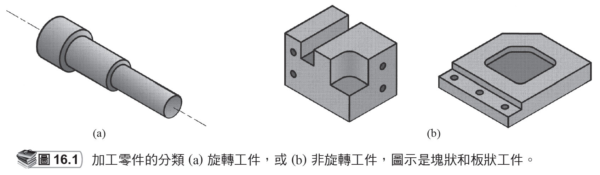

# 章節總覽

來源：第 16 章《機械加工作業和機具》簡報。

本檔依原簡報投影片順序整理，保留逐頁文字內容，並在相同投影片下附上對應圖片或圖表影像。

## 投影片 1

### 文字內容

- 第 16 章
- 機械加工作業和機具

## 投影片 2

### 文字內容

- 章節內容
- 16.1 機械加工和零件幾何
- 16.2 車削及相關作業
- 車削的切削條件
- 車削的相關作業
- 動力車床
- 其他車床和車削機
- 搪孔機
- 16.3 鑽孔及相關作業
- 鑽孔的切削條件
- 鑽孔的相關作業
- 鑽床
- 16.4 銑削
- 銑削作業的種類
- 銑削的切削條件
- 銑床

## 投影片 3

### 文字內容

- 章節內容
- 16.5 綜合加工機和車削中心
- 16.6 其他機械加工作業
- 牛頭刨削和龍門刨削
- 拉削
- 鋸削
- 16.7 高速機械加工
- 16.8 公差和表面光潔度
- 加工的公差
- 機械加工的表面光潔度
- 16.9 機械加工的產品設計考量

## 投影片 4

### 文字內容

- 加工零件的分類

### 圖片 / 圖表

