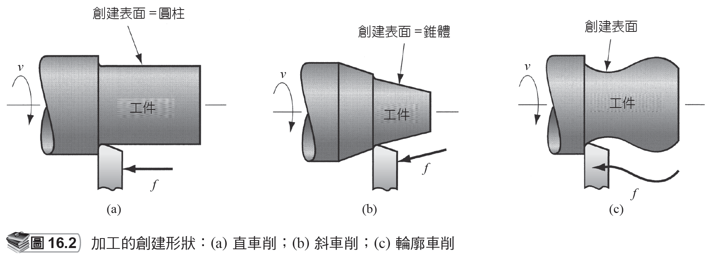
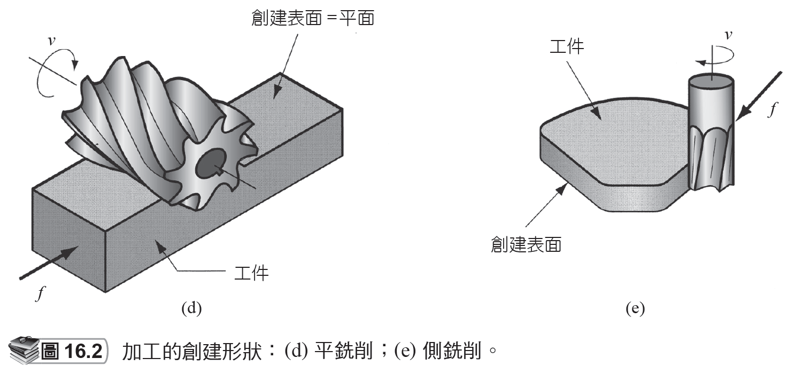
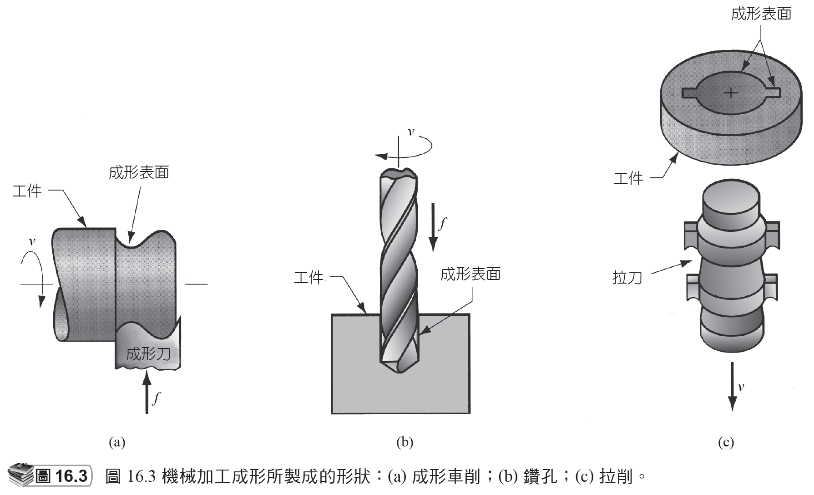
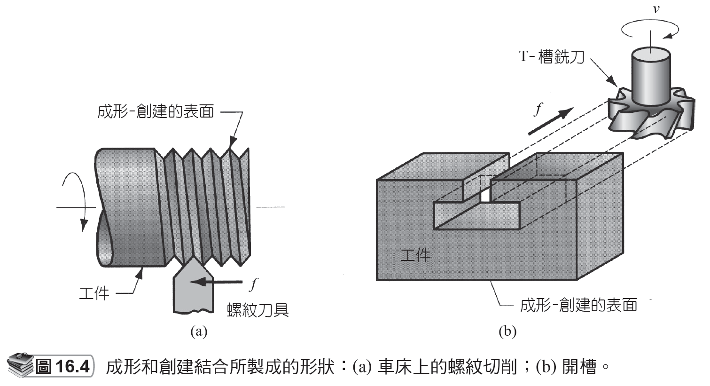

# 16.1 機械加工和零件幾何

來源：第 16 章《機械加工作業和機具》簡報。

本檔依原簡報投影片順序整理，保留逐頁文字內容，並在相同投影片下附上對應圖片或圖表影像。

## 投影片 5

### 文字內容

- 16.1 機械加工和零件幾何
- 每個加工作業由於兩個因素，會生產出具特性的幾何形狀：
- 刀具和工件之間的相對運動
- 創建 (generating)：工件的幾何形狀取決於切削刀具的進給軌跡。
- 切削刀具的形狀
- 成形 (forming)：是指工件形狀是由切削刀具幾何形狀所造成。

### 研究所層級專有名詞解釋

- **機械加工**：以刀具相對於工件的受控運動移除材料，核心分析量包含切削速度、進給、切深、刀具幾何、切削力、熱、振動與表面完整性。
- **相對運動**：刀具與工件之間的速度場，包含主運動與進給運動；它決定切屑形成方向、表面紋理與幾何生成方式。
- **切削刀具**：承受高接觸壓力與局部高溫的楔形工具；設計時需平衡鋒利度、強度、導熱、耐磨耗與抗崩裂能力。
- **創建**：Generating 指由刀具軌跡掃掠出幾何形狀，研究所層級會把它視為刀具包絡面、相對運動學與幾何誤差的問題。
- **成形**：Forming 指工件輪廓主要由刀具輪廓直接複製；其限制常來自刀具製造精度、磨耗後輪廓漂移與切削負載集中。
- **進給**：刀具每轉或每齒相對工件前進量，是材料移除率、刀痕高度、切削力與表面粗糙度的主控參數之一。

## 投影片 6

### 文字內容

- 創建形狀 -1

### 圖片 / 圖表

### 研究所層級專有名詞解釋

- **創建**：Generating 指由刀具軌跡掃掠出幾何形狀，研究所層級會把它視為刀具包絡面、相對運動學與幾何誤差的問題。

### 圖片 / 圖表研究所說明

- 圖中重點是刀具路徑如何掃掠出表面。可從相對運動學角度理解：刀具刃口不是完整工件輪廓，但其包絡面定義了加工表面，因此機台軸向誤差會直接轉換為形狀誤差。

## 投影片 7

### 文字內容

- 創建形狀 -2

### 圖片 / 圖表

### 研究所層級專有名詞解釋

- **創建**：Generating 指由刀具軌跡掃掠出幾何形狀，研究所層級會把它視為刀具包絡面、相對運動學與幾何誤差的問題。

### 圖片 / 圖表研究所說明

- 此圖延伸創建形狀的概念，通常可觀察不同進給方向或主運動配置如何產生平面、圓柱面或輪廓面。分析時可把刀尖軌跡視為幾何生成函數。

## 投影片 8

### 文字內容

- 機械加工成形所製成的形狀

### 圖片 / 圖表

### 研究所層級專有名詞解釋

- **機械加工**：以刀具相對於工件的受控運動移除材料，核心分析量包含切削速度、進給、切深、刀具幾何、切削力、熱、振動與表面完整性。
- **成形**：Forming 指工件輪廓主要由刀具輪廓直接複製；其限制常來自刀具製造精度、磨耗後輪廓漂移與切削負載集中。

### 圖片 / 圖表研究所說明

- 此圖展示成形加工，應注意刀具輪廓與工件輪廓的對應關係。研究重點在於刀具輪廓磨耗後會直接複製到工件，因此刀具補償與定期量測非常重要。

## 投影片 9

### 文字內容

- 成形和創建結合所製成的形狀

### 圖片 / 圖表

### 研究所層級專有名詞解釋

- **創建**：Generating 指由刀具軌跡掃掠出幾何形狀，研究所層級會把它視為刀具包絡面、相對運動學與幾何誤差的問題。
- **成形**：Forming 指工件輪廓主要由刀具輪廓直接複製；其限制常來自刀具製造精度、磨耗後輪廓漂移與切削負載集中。

### 圖片 / 圖表研究所說明

- 圖中顯示成形與創建的耦合：刀具提供局部輪廓，進給或旋轉提供整體幾何。這類加工常需要同時控制刀具形狀誤差與機台運動誤差。
