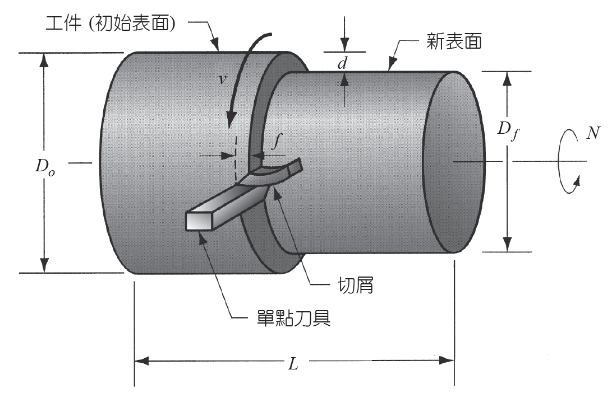
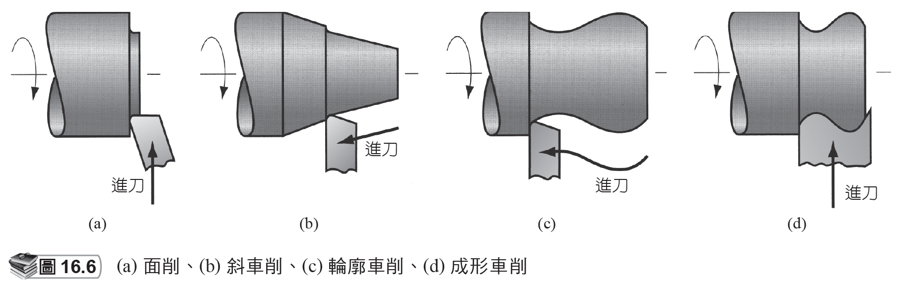
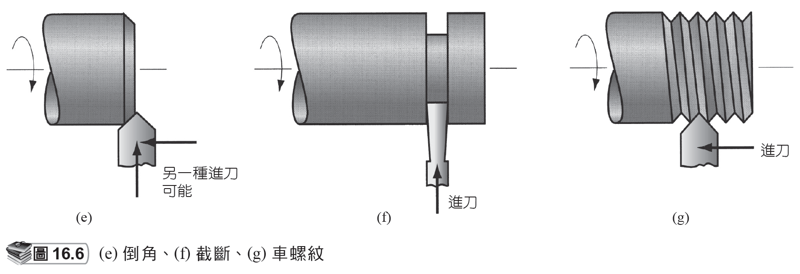
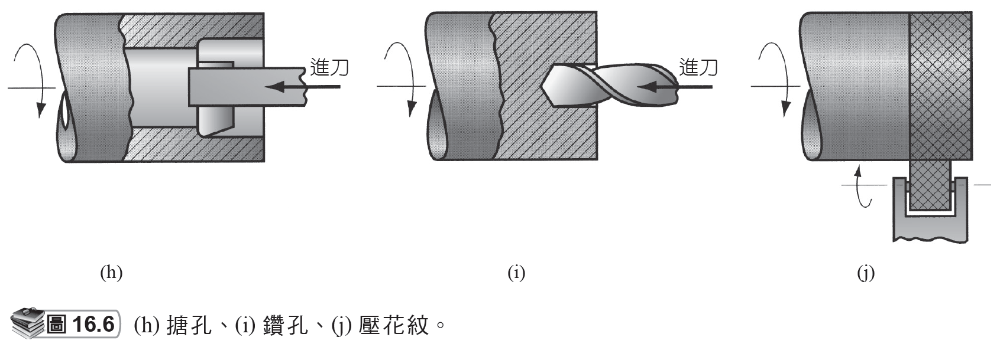
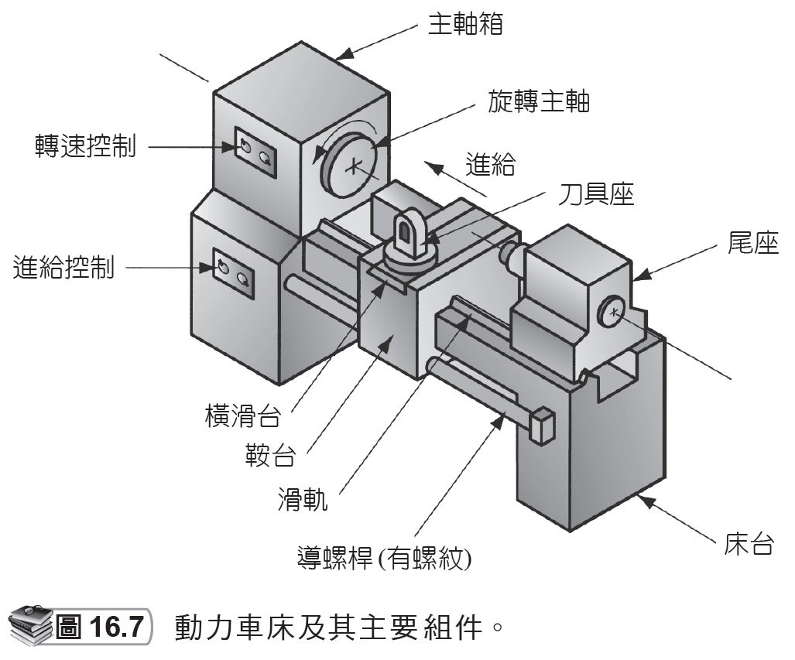
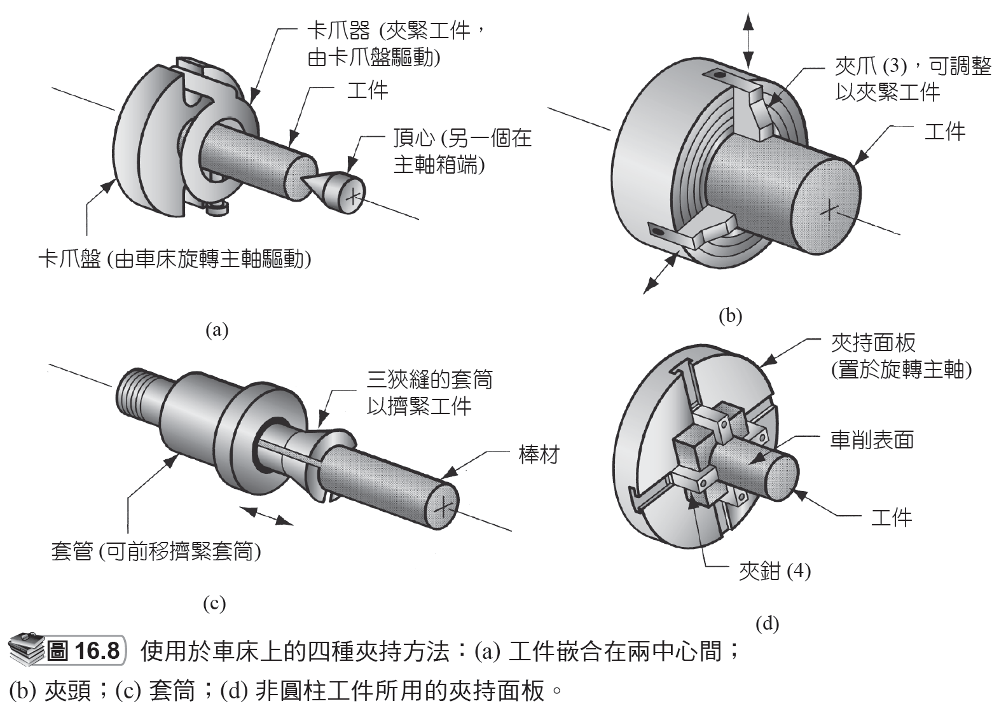
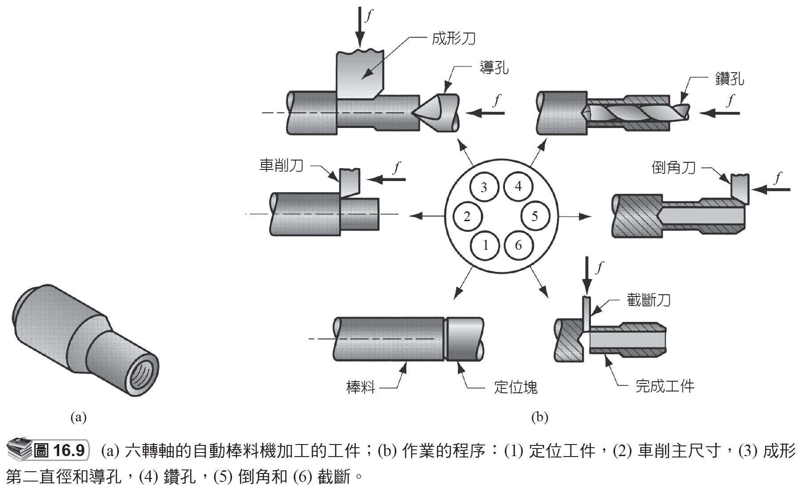
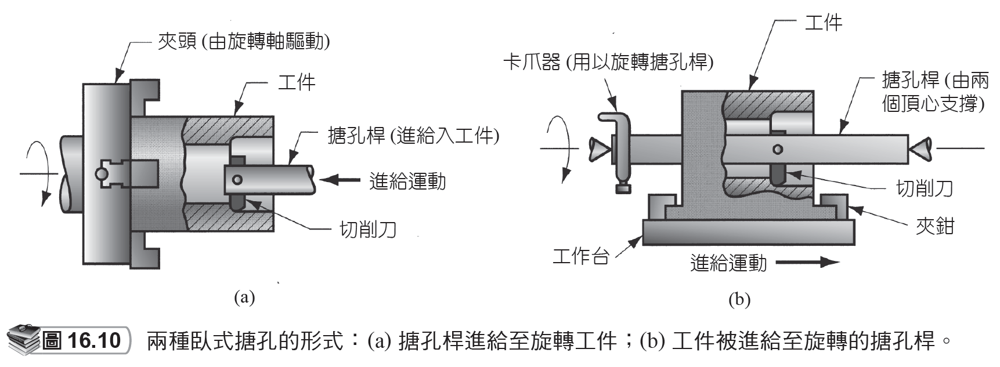
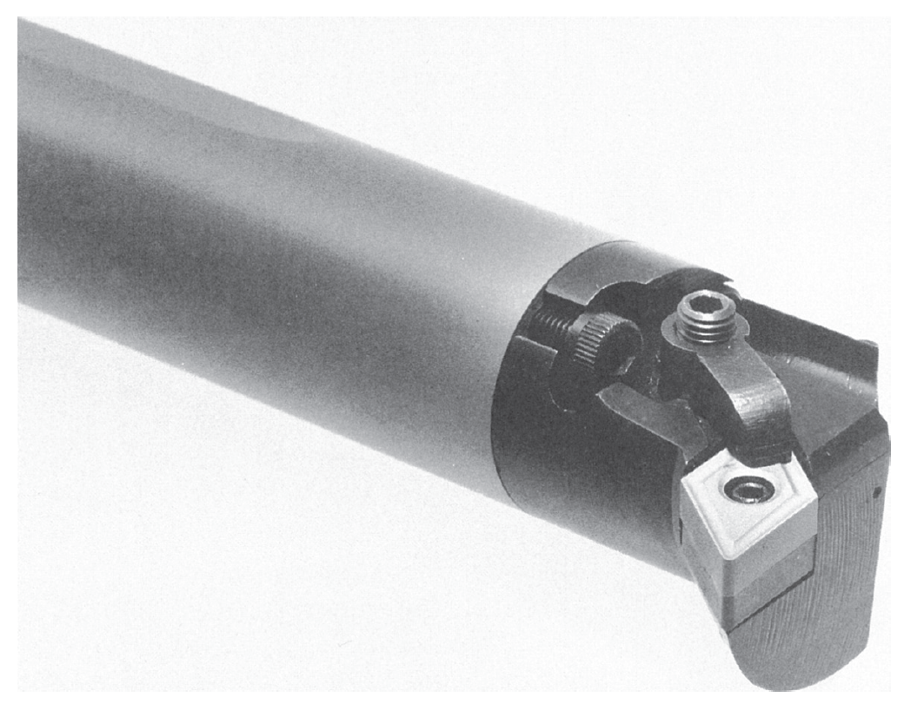
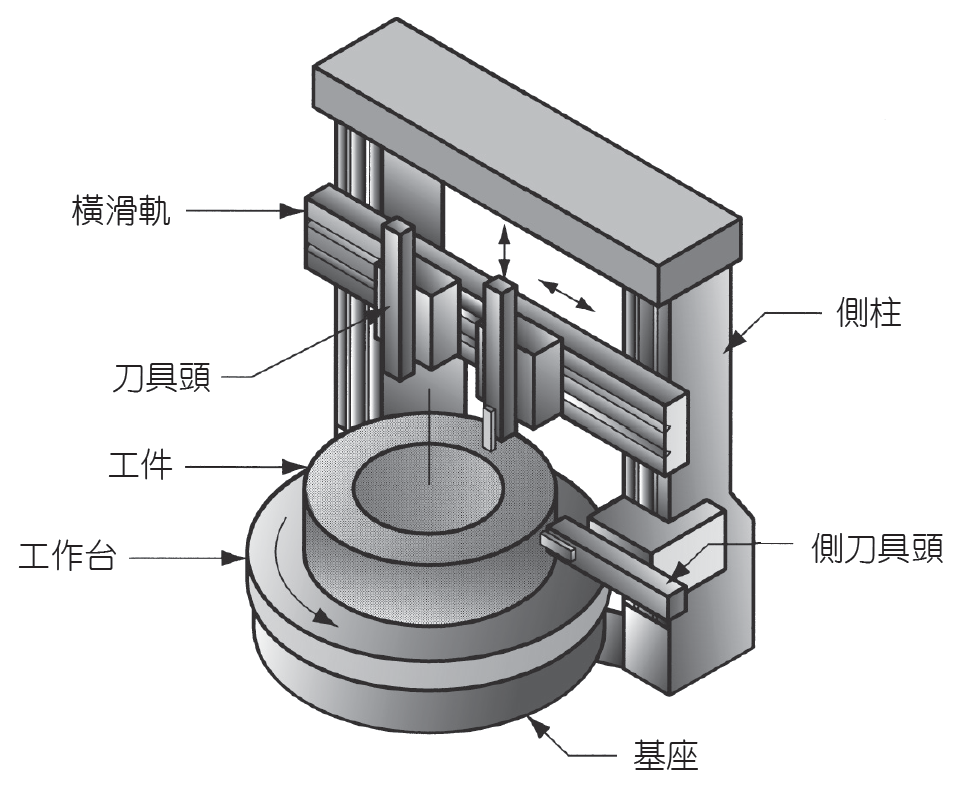

# 16.2 車削及相關作業

來源：第 16 章《機械加工作業和機具》簡報。

本檔依原簡報投影片順序整理，保留逐頁文字內容，並在相同投影片下附上對應圖片或圖表影像。

## 投影片 10

### 文字內容

- 16.2 車削及相關作業
- 利用單點刀具將材料從旋轉工件表面去除，進給而產生圓柱狀的幾何形狀。
- 是在一種稱為車床 (lathe) 的機具上操作。
- 其他多種也在車床上進行操作的加工作業：
- 面削 (Facing)
- 輪廓車削 (Contour turning)
- 倒角 (Chamfering)
- 截斷 (Cutoff )
- 車螺紋 (Threading)

### 研究所層級專有名詞解釋

- **單點刀具**：只有一個主要切削刃參與切削的刀具；其前角、後角、刀尖半徑與斷屑槽會直接影響力、熱與表面品質。
- **輪廓車削**：Contour turning 透過受控刀具路徑形成非直線母線輪廓，是 CNC 車削中結合幾何插補與刀尖半徑補償的典型任務。
- **車螺紋**：Threading 需同步主軸角位置與軸向進給，使刀具沿螺旋線生成牙形；重點在導程誤差、牙形角與刀尖磨耗控制。
- **進給**：刀具每轉或每齒相對工件前進量，是材料移除率、刀痕高度、切削力與表面粗糙度的主控參數之一。
- **車削**：Turning 以工件旋轉為主運動、單點刀具進給為輔運動，適合產生軸對稱外形並可延伸至端面、槽、錐面與螺紋。
- **車床**：提供主軸旋轉、刀具進給與工件支撐的基礎機具；精度受主軸迴轉誤差、導軌直線度、熱變形與夾持剛性支配。
- **面削**：Facing 用徑向進給加工端面，常用於建立長度基準；其平面度與垂直度取決於主軸軸線與刀架運動的幾何關係。
- **倒角**：Chamfering 去除尖邊並形成斜面，可降低毛邊、應力集中與裝配干涉；在量產中也常作為自動裝配導入特徵。
- **截斷**：Cutoff 或 parting 使用窄刀切離工件，因刀具細長且排屑受限，特別容易受顫振、刀具撓曲與熱累積影響。
- **螺紋**：Thread 是螺旋幾何特徵，可由車削、攻牙、滾牙或銑削製成；設計需考慮標準牙型與有效嚙合長度。

## 投影片 11

### 文字內容

- 車削作業

### 圖片 / 圖表

### 研究所層級專有名詞解釋

- **車削**：Turning 以工件旋轉為主運動、單點刀具進給為輔運動，適合產生軸對稱外形並可延伸至端面、槽、錐面與螺紋。

### 圖片 / 圖表研究所說明

- 此圖可用來辨識車削的主運動、進給方向、切深與已加工表面。研究所層級應進一步連結切削速度、進給與切深對切削力、刀具磨耗及表面粗糙度的影響。

## 投影片 12

### 文字內容

- 車削的相關作業 -1

### 圖片 / 圖表

### 研究所層級專有名詞解釋

- **車削**：Turning 以工件旋轉為主運動、單點刀具進給為輔運動，適合產生軸對稱外形並可延伸至端面、槽、錐面與螺紋。

### 圖片 / 圖表研究所說明

- 圖中各種車削相關作業可視為同一機台運動架構下的特徵加工。重點是不同刀具進給方向與刀具幾何會產生端面、錐面、溝槽或輪廓。

## 投影片 13

### 文字內容

- 車削的相關作業 -2

### 圖片 / 圖表

### 研究所層級專有名詞解釋

- **車削**：Turning 以工件旋轉為主運動、單點刀具進給為輔運動，適合產生軸對稱外形並可延伸至端面、槽、錐面與螺紋。

### 圖片 / 圖表研究所說明

- 此圖通常強調孔、螺紋或內外徑特徵在車床上的加工方式。分析時要注意內加工受刀桿懸伸限制，剛性與排屑比外徑車削更困難。

## 投影片 14

### 文字內容

- 車削的相關作業 -3

### 圖片 / 圖表

### 研究所層級專有名詞解釋

- **車削**：Turning 以工件旋轉為主運動、單點刀具進給為輔運動，適合產生軸對稱外形並可延伸至端面、槽、錐面與螺紋。

### 圖片 / 圖表研究所說明

- 此圖可用來比較倒角、截斷、螺紋等作業的刀具負載差異。截斷刀具窄而長，螺紋刀具需保持牙形精度，因此兩者都對振動和對刀誤差敏感。

## 投影片 15

### 文字內容

- 動力車床 (engine lathe)

### 圖片 / 圖表

### 研究所層級專有名詞解釋

- **動力車床**：Engine lathe 是通用性高的傳統車床，適合小批量與教學；其價值在操作彈性，而非自動化節拍。
- **車床**：提供主軸旋轉、刀具進給與工件支撐的基礎機具；精度受主軸迴轉誤差、導軌直線度、熱變形與夾持剛性支配。

### 圖片 / 圖表研究所說明

- 動力車床圖應閱讀床身、主軸箱、尾座、刀架與溜板的功能分工。研究所層級可將其看成一個結構迴路，切削力如何經刀具、工件、夾持與床身閉合，會決定剛性與精度。

## 投影片 16

### 文字內容

- 車床上工件的夾持方法

### 圖片 / 圖表

### 研究所層級專有名詞解釋

- **車床**：提供主軸旋轉、刀具進給與工件支撐的基礎機具；精度受主軸迴轉誤差、導軌直線度、熱變形與夾持剛性支配。

### 圖片 / 圖表研究所說明

- 此圖說明夾頭、頂心、面盤或其他夾持方式。關鍵不是只看如何固定，而是評估定位自由度、支撐跨度、夾持變形與加工後基準是否一致。

## 投影片 17

### 文字內容

- 其他車床和車削機
- 轉塔車床 (turret lathe)
- 夾持機 (chucking machine)
- 棒料機 (bar machine)
- 自動攻牙機 (automatic screw machine)
- 多軸棒料機 (multiple spindle bar machine)

### 研究所層級專有名詞解釋

- **自動攻牙機**：Automatic screw machine 主要生產螺絲與小型旋轉五金，強調高節拍、重複精度與自動送料。
- **多軸棒料機**：Multiple spindle bar machine 以多主軸分站同步加工，將工序並行化，是典型以設備複雜度換取產能的設計。
- **轉塔車床**：Turret lathe 以可轉位刀塔縮短換刀時間，適合多步驟軸類零件；分析重點是工序排序與刀具干涉。
- **夾持機**：Chucking machine 以夾頭夾持短件並自動進給，適合短小零件量產；限制是缺少尾座支撐。
- **棒料機**：Bar machine 讓長棒材經主軸連續送料，將車削、截斷與下一件備料整合成循環生產。
- **車削**：Turning 以工件旋轉為主運動、單點刀具進給為輔運動，適合產生軸對稱外形並可延伸至端面、槽、錐面與螺紋。
- **車床**：提供主軸旋轉、刀具進給與工件支撐的基礎機具；精度受主軸迴轉誤差、導軌直線度、熱變形與夾持剛性支配。
- **轉塔**：可容納多把刀具並快速定位的刀具承載結構；其定位剛性與重複精度會直接影響尺寸一致性。

## 投影片 18

### 文字內容

- 轉塔車床
- 是把尾座替換成最多可容納六把刀具的轉塔。
- 這些刀具可經由轉塔的轉位而迅速的在工件上一一加工。
- 動力車床上常見的刀架也替換成一個可轉位及最多容納四把刀具的轉塔。
- 應用：常用來加工需要序列切削的高生產量工件。

### 研究所層級專有名詞解釋

- **動力車床**：Engine lathe 是通用性高的傳統車床，適合小批量與教學；其價值在操作彈性，而非自動化節拍。
- **轉塔車床**：Turret lathe 以可轉位刀塔縮短換刀時間，適合多步驟軸類零件；分析重點是工序排序與刀具干涉。
- **車床**：提供主軸旋轉、刀具進給與工件支撐的基礎機具；精度受主軸迴轉誤差、導軌直線度、熱變形與夾持剛性支配。
- **轉塔**：可容納多把刀具並快速定位的刀具承載結構；其定位剛性與重複精度會直接影響尺寸一致性。
- **尾座**：支撐長工件或安裝鑽頭的車床部件；尾座與主軸不同心會造成錐度誤差。

## 投影片 19

### 文字內容

- 夾持機
- 在旋轉主軸上使用夾頭來夾持工件。
- 沒有尾座，因此無法將工件嵌合在兩中心間。
- 刀具的進給動作是自動控制。
- 操作人員的功能：來裝載 / 卸載工件。
- 應用：使用在短及輕的工件上。

### 研究所層級專有名詞解釋

- **夾持機**：Chucking machine 以夾頭夾持短件並自動進給，適合短小零件量產；限制是缺少尾座支撐。
- **進給**：刀具每轉或每齒相對工件前進量，是材料移除率、刀痕高度、切削力與表面粗糙度的主控參數之一。
- **尾座**：支撐長工件或安裝鑽頭的車床部件；尾座與主軸不同心會造成錐度誤差。
- **夾頭**：Chuck 透過爪或夾持面傳遞扭矩與定位工件；夾持力不足會滑移，過大則可能造成薄壁件變形。

## 投影片 20

### 文字內容

- 棒料機
- 和夾持機類似只是其使用套筒而非夾頭。其特色是允許長的棒材經由主軸箱直接進料後進入切削位置。
- 在每個加工週期結束後，會截斷工件。
- 高程度的自動化操作
- 電腦數值控制 (computer numerical control, CNC)
- 應用：生產旋轉的工件。

### 研究所層級專有名詞解釋

- **電腦數值控制**：CNC 將刀具路徑、主軸、進給與輔助功能數位化控制；研究重點包含插補、伺服誤差、加減速與後處理。
- **夾持機**：Chucking machine 以夾頭夾持短件並自動進給，適合短小零件量產；限制是缺少尾座支撐。
- **棒料機**：Bar machine 讓長棒材經主軸連續送料，將車削、截斷與下一件備料整合成循環生產。
- **CNC**：Computer numerical control，以程式控制機台運動與加工循環；它讓複雜幾何與重複生產可系統化。
- **截斷**：Cutoff 或 parting 使用窄刀切離工件，因刀具細長且排屑受限，特別容易受顫振、刀具撓曲與熱累積影響。
- **夾頭**：Chuck 透過爪或夾持面傳遞扭矩與定位工件；夾持力不足會滑移，過大則可能造成薄壁件變形。
- **套筒**：Collet 以彈性夾持提供高同心度，常用於棒材與小直徑件；適合尺寸穩定的圓棒。

## 投影片 21

### 文字內容

- 自動攻牙機
- 和自動棒料機相似但比較小。
- 應用：生產螺絲和類似的小硬體件。

### 研究所層級專有名詞解釋

- **自動攻牙機**：Automatic screw machine 主要生產螺絲與小型旋轉五金，強調高節拍、重複精度與自動送料。
- **棒料機**：Bar machine 讓長棒材經主軸連續送料，將車削、截斷與下一件備料整合成循環生產。

## 投影片 22

### 文字內容

- 多軸棒料機
- 這些機器有一個以上的旋轉主軸，因此，多個工件可經由多把刀具同時進行加工。
- 例如，六轉軸的自動棒料機可同時加工於六個工件。
- 在每個加工週期結束後，旋轉軸 (包括套筒及棒料) 會轉位至下一個位置。

### 研究所層級專有名詞解釋

- **多軸棒料機**：Multiple spindle bar machine 以多主軸分站同步加工，將工序並行化，是典型以設備複雜度換取產能的設計。
- **棒料機**：Bar machine 讓長棒材經主軸連續送料，將車削、截斷與下一件備料整合成循環生產。
- **套筒**：Collet 以彈性夾持提供高同心度，常用於棒材與小直徑件；適合尺寸穩定的圓棒。

## 投影片 23

### 文字內容

- 六轉軸的自動棒料機

### 圖片 / 圖表

### 研究所層級專有名詞解釋

- **棒料機**：Bar machine 讓長棒材經主軸連續送料，將車削、截斷與下一件備料整合成循環生產。

### 圖片 / 圖表研究所說明

- 六主軸棒料機圖的重點是並行工序。每個主軸位置代表一個工站，轉位後工件進入下一加工階段，因此產能由最慢工站決定，這是典型產線平衡問題。

## 投影片 24

### 文字內容

- 搪孔
- 搪孔和車削的差異：
- 搪孔是在既有的孔洞內徑操作。
- 車削是在圓柱的外徑上執行。
- 實際上，搪孔是一種內車削作業。
- 搪孔機 (boring machine)
- 可為水平或垂直式的，區別方式依據機台旋轉主軸或工件的方向。

### 研究所層級專有名詞解釋

- **搪孔機**：Boring machine 用於較大或較精密孔加工，關鍵問題是刀桿懸伸、主軸剛性與孔軸線位置精度。
- **車削**：Turning 以工件旋轉為主運動、單點刀具進給為輔運動，適合產生軸對稱外形並可延伸至端面、槽、錐面與螺紋。
- **搪孔**：Boring 在既有孔內進行單點內徑加工，可改善孔徑、圓度、同軸度與表面粗糙度。

## 投影片 25

### 文字內容

- 兩種臥式搪孔的形式

### 圖片 / 圖表

### 研究所層級專有名詞解釋

- **搪孔**：Boring 在既有孔內進行單點內徑加工，可改善孔徑、圓度、同軸度與表面粗糙度。

### 圖片 / 圖表研究所說明

- 臥式搪孔形式圖可比較工件旋轉與刀具旋轉兩種配置。研究重點在孔軸線精度、刀桿懸伸、支撐方式與大型工件定位策略。

## 投影片 26

### 文字內容

- 硬質合金搪孔桿

### 圖片 / 圖表

### 研究所層級專有名詞解釋

- **硬質合金**：Carbide 具高硬度與耐熱性，可提高切削速度；但韌性低於高速鋼，需避免衝擊與不穩定切削。
- **搪孔桿**：Boring bar 是內孔單點切削的刀桿；其長徑比越大越容易顫振，因此材料、截面與阻尼設計很重要。
- **搪孔**：Boring 在既有孔內進行單點內徑加工，可改善孔徑、圓度、同軸度與表面粗糙度。

### 圖片 / 圖表研究所說明

- 硬質合金搪孔桿圖應注意刀桿長徑比與刀尖位置。內孔加工的穩定性常受刀桿撓曲與顫振限制，使用硬質合金可提高剛性與固有頻率。

## 投影片 27

### 文字內容

- 立式搪孔機(vertical boring machine, VBM)
- 應用：用於大又重且直徑大於長度的工件。

### 圖片 / 圖表

### 研究所層級專有名詞解釋

- **立式搪孔機**：Vertical boring machine 適合大直徑短厚件，讓重工件置於水平工作台上，可降低大型件夾持與旋轉支撐難度。
- **搪孔機**：Boring machine 用於較大或較精密孔加工，關鍵問題是刀桿懸伸、主軸剛性與孔軸線位置精度。
- **搪孔**：Boring 在既有孔內進行單點內徑加工，可改善孔徑、圓度、同軸度與表面粗糙度。

### 圖片 / 圖表研究所說明

- 立式搪孔機圖顯示大型短厚工件置於旋轉工作台上的優勢。此配置讓重力協助支撐工件，適合加工大型法蘭、輪轂或短圓筒類零件。
