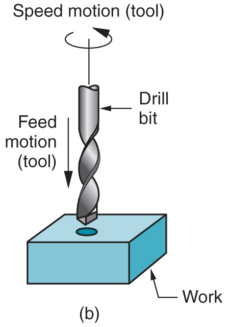
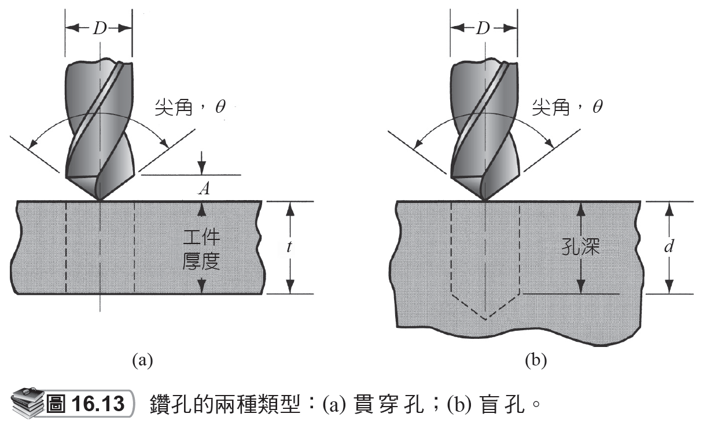
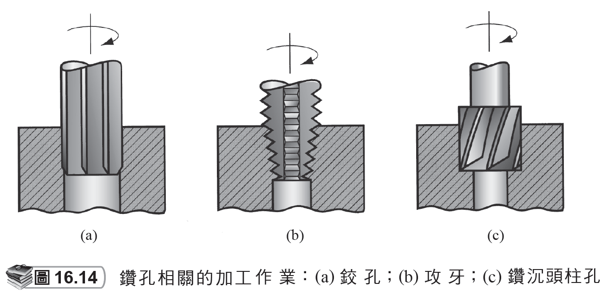
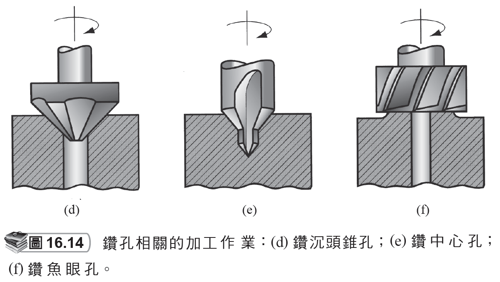
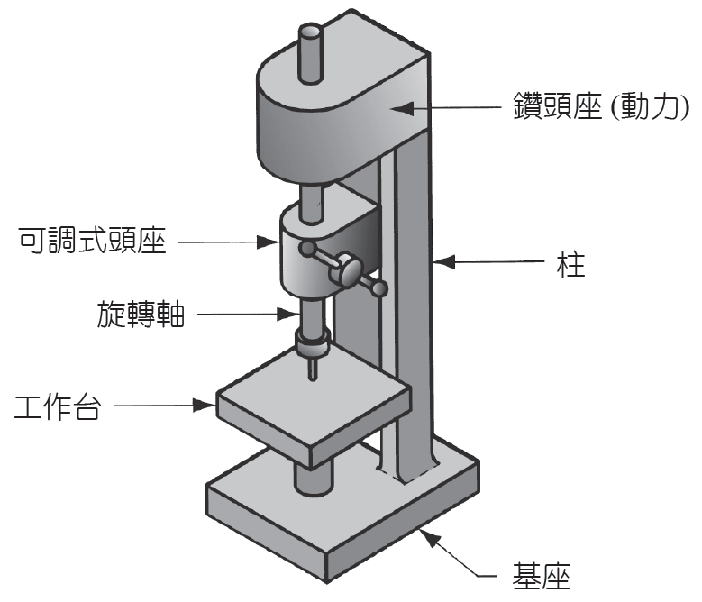
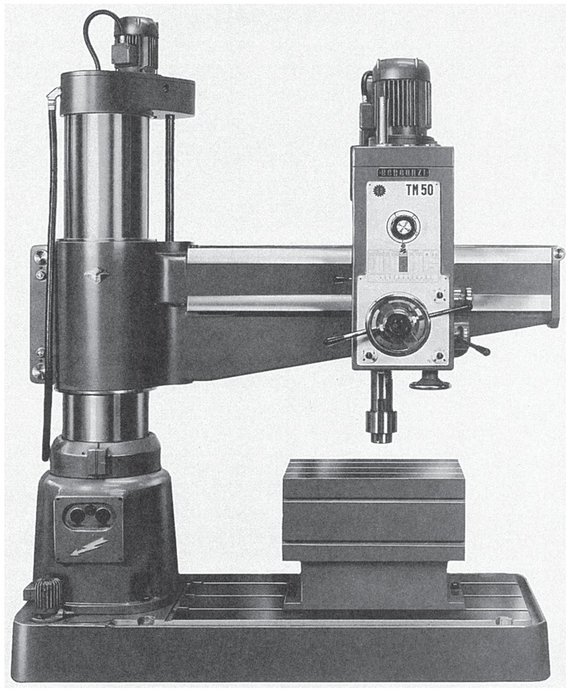

# 16.3 鑽孔及相關作業

來源：第 16 章《機械加工作業和機具》簡報。

本檔依原簡報投影片順序整理，保留逐頁文字內容，並在相同投影片下附上對應圖片或圖表影像。

## 投影片 28

### 文字內容

- 16.3 鑽孔及相關作業鑽孔
- 是一種用於創建工件圓孔的加工作業。
- 和只能用於放大一個既成孔洞的搪孔成對照。
- 刀具被稱為鑽 (drill) 或鑽頭 (drill bit)。
- 鑽孔的標準機具為鑽床。

### 圖片 / 圖表

### 研究所層級專有名詞解釋

- **創建**：Generating 指由刀具軌跡掃掠出幾何形狀，研究所層級會把它視為刀具包絡面、相對運動學與幾何誤差的問題。
- **搪孔**：Boring 在既有孔內進行單點內徑加工，可改善孔徑、圓度、同軸度與表面粗糙度。
- **鑽孔**：Drilling 以旋轉鑽頭建立圓孔，孔品質受鑽尖幾何、排屑、冷卻、走偏與工件材料影響。
- **鑽頭**：Drill bit 的鑽尖角、螺旋角與橫刃會影響定心能力、推力與孔壁品質。
- **鑽床**：Drill press 提供鑽頭旋轉與軸向進給；相較加工中心，其定位彈性與剛性通常較低。
- **鑽**：Drill 是孔加工刀具，兼具切削刃、容屑槽與導向邊；深孔加工時排屑與冷卻比單純切削更關鍵。

### 圖片 / 圖表研究所說明

- 鑽孔圖應觀察鑽頭的旋轉、軸向進給與切屑沿螺旋槽排出。研究所層級可討論鑽尖橫刃造成的推力、孔走偏與入口毛邊。

## 投影片 29

### 文字內容

- 貫穿孔與盲孔

### 圖片 / 圖表

### 研究所層級專有名詞解釋

- **貫穿孔**：Through hole 完全穿透工件，出口側常產生毛邊；設計與製程需考慮背面支撐與去毛邊。
- **盲孔**：Blind hole 未穿透工件，需控制深度、底部形狀與切屑堆積；攻牙時尤其要注意有效牙深。

### 圖片 / 圖表研究所說明

- 貫穿孔與盲孔圖的重點在出口條件與深度控制。貫穿孔有出口毛邊問題，盲孔則有底部幾何、排屑與有效加工深度限制。

## 投影片 30

### 文字內容

- 鑽孔的相關作業 -1

### 圖片 / 圖表

### 研究所層級專有名詞解釋

- **鑽孔**：Drilling 以旋轉鑽頭建立圓孔，孔品質受鑽尖幾何、排屑、冷卻、走偏與工件材料影響。
- **鑽**：Drill 是孔加工刀具，兼具切削刃、容屑槽與導向邊；深孔加工時排屑與冷卻比單純切削更關鍵。

### 圖片 / 圖表研究所說明

- 此圖展示鑽孔後續作業，通常包含沉頭、鍃孔、鉸孔或攻牙。可將其理解為同一孔特徵在尺寸、表面、裝配與螺紋功能上的逐步精修。

## 投影片 31

### 文字內容

- 鑽孔的相關作業 -2

### 圖片 / 圖表

### 研究所層級專有名詞解釋

- **鑽孔**：Drilling 以旋轉鑽頭建立圓孔，孔品質受鑽尖幾何、排屑、冷卻、走偏與工件材料影響。
- **鑽**：Drill 是孔加工刀具，兼具切削刃、容屑槽與導向邊；深孔加工時排屑與冷卻比單純切削更關鍵。

### 圖片 / 圖表研究所說明

- 此圖延伸孔加工特徵，重點是不同孔口幾何會服務不同螺栓、沉頭螺絲或定位需求。設計時應優先採標準尺寸以降低刀具與檢驗成本。

## 投影片 32

### 文字內容

- 鑽床
- 直立鑽床 (upright drill) 設置於地板上。
- 檯式鑽床 (bench drill) 類似鑽床，但體積較小而被安置在桌面或工作台上。

### 圖片 / 圖表

### 研究所層級專有名詞解釋

- **直立鑽床**：Upright drill 為落地式通用鑽床，可處理較大工件與較高推力。
- **檯式鑽床**：Bench drill 體積小、剛性與行程較有限，適合小件、輕切削與教學操作。
- **鑽床**：Drill press 提供鑽頭旋轉與軸向進給；相較加工中心，其定位彈性與剛性通常較低。
- **鑽**：Drill 是孔加工刀具，兼具切削刃、容屑槽與導向邊；深孔加工時排屑與冷卻比單純切削更關鍵。

### 圖片 / 圖表研究所說明

- 鑽床圖可比較直立鑽床與檯式鑽床的尺寸、行程與剛性。研究重點在機台剛性不足時，孔位置與孔垂直度會受工件固定與進給力影響。

## 投影片 33

### 文字內容

- 旋臂鑽床 (radial drill)

### 圖片 / 圖表

### 研究所層級專有名詞解釋

- **旋臂鑽床**：Radial drill 讓主軸沿旋臂移動，可在大型工件不同位置鑽孔，減少搬動重件造成的定位誤差。
- **鑽床**：Drill press 提供鑽頭旋轉與軸向進給；相較加工中心，其定位彈性與剛性通常較低。
- **鑽**：Drill 是孔加工刀具，兼具切削刃、容屑槽與導向邊；深孔加工時排屑與冷卻比單純切削更關鍵。

### 圖片 / 圖表研究所說明

- 旋臂鑽床圖顯示大型工件多孔加工的便利性。其工程價值在於移動主軸而非移動工件，但旋臂鎖緊剛性與定位誤差需特別注意。

## 投影片 34

### 文字內容

- 鑽床上工件的夾持
- 鑽床上工件的夾持可經由工件夾鉗在虎鉗、夾具及導夾具上：
- 虎鉗 (vise)：是一種通用的工件夾持裝置，其擁有兩個爪來抓緊工件於定位。
- 夾具 (fixture)：通常是一種為特定的工件而客製化的工件夾持裝置。
- 導夾具 (jig)：和夾具相似，但導夾具的鑽孔作業過程中有提供導引刀具的方式。

### 研究所層級專有名詞解釋

- **工件夾持**：Workholding 決定工件座標系與邊界條件，會影響同心度、定位重複性、切削剛性與振動穩定性。
- **導夾具**：Jig 除定位夾持外還導引刀具，典型用於鑽孔；它把孔位置精度部分轉移到襯套與治具設計上。
- **鑽孔**：Drilling 以旋轉鑽頭建立圓孔，孔品質受鑽尖幾何、排屑、冷卻、走偏與工件材料影響。
- **鑽床**：Drill press 提供鑽頭旋轉與軸向進給；相較加工中心，其定位彈性與剛性通常較低。
- **虎鉗**：Vise 是通用夾持裝置，適合簡單工件；但定位重複性與專用支撐通常不如客製夾具。
- **夾具**：Fixture 用來固定工件並建立定位基準；研究所層級需分析定位自由度、夾緊力路徑與變形。
- **鑽**：Drill 是孔加工刀具，兼具切削刃、容屑槽與導向邊；深孔加工時排屑與冷卻比單純切削更關鍵。
