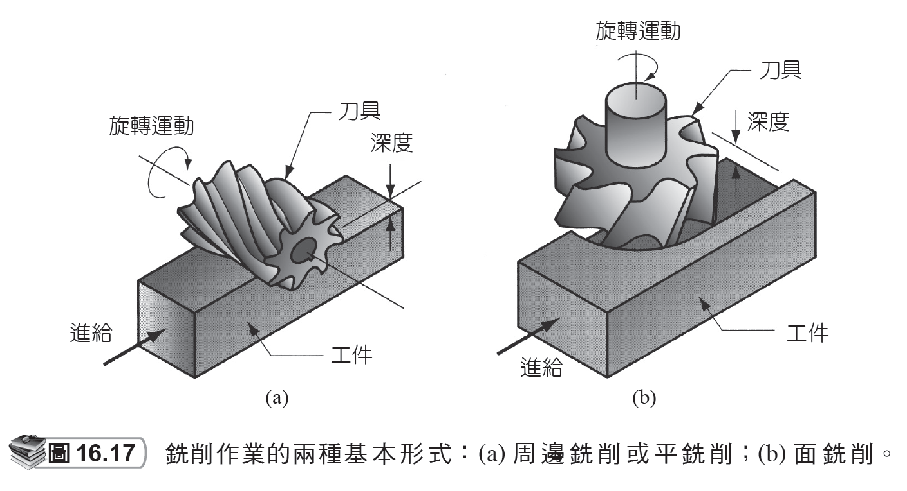
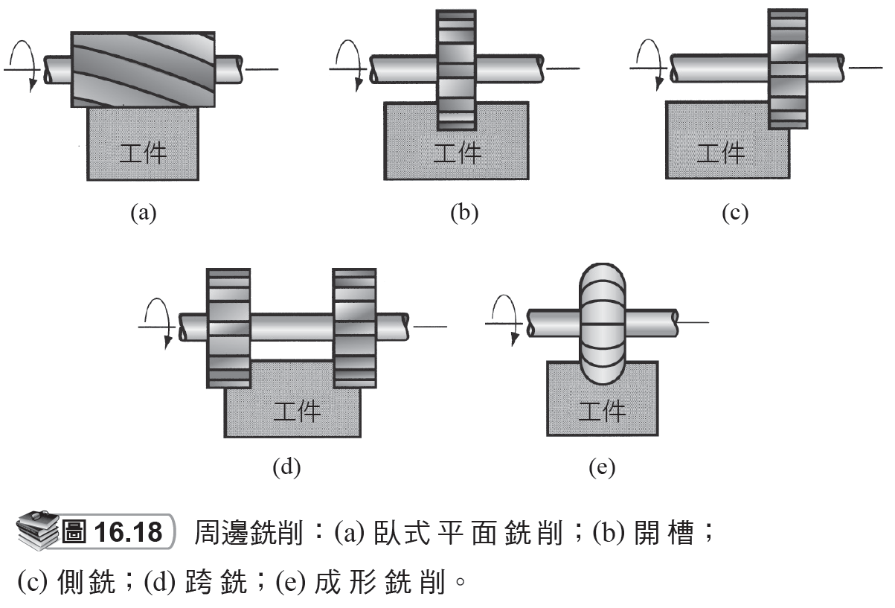
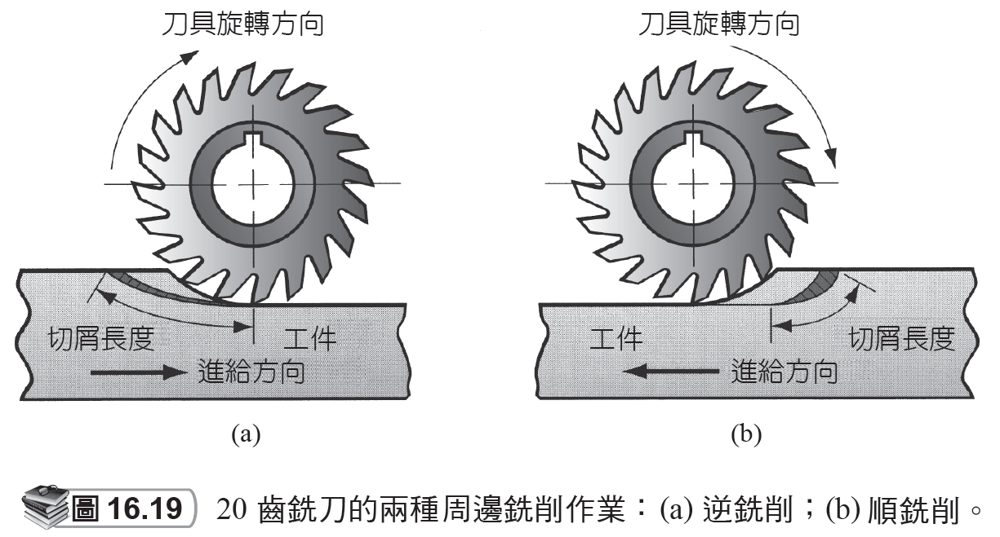
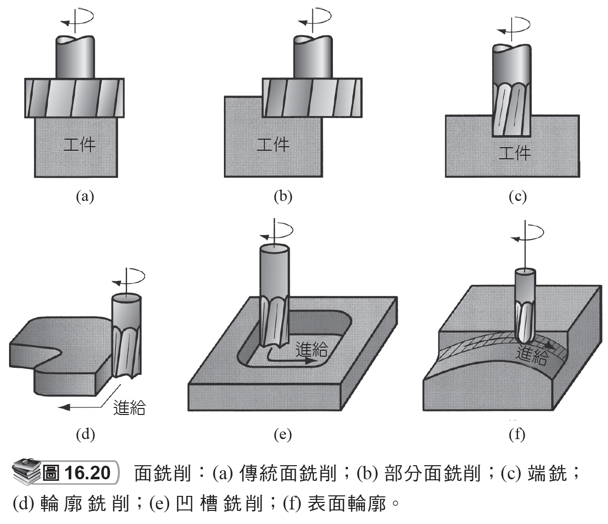
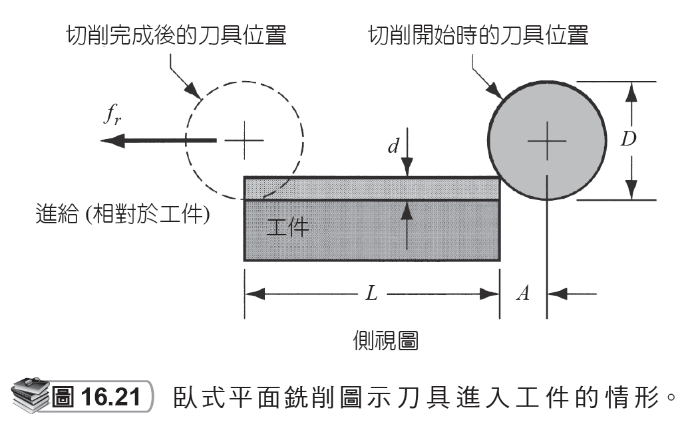
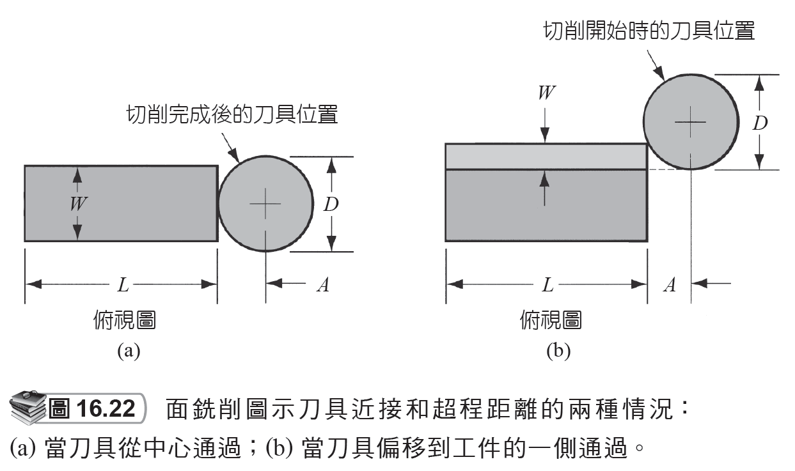
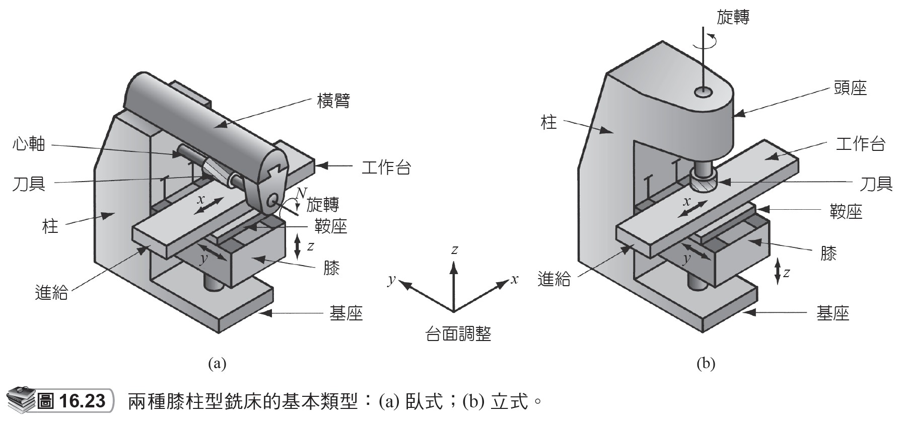
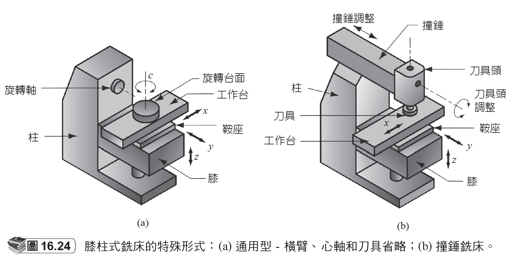
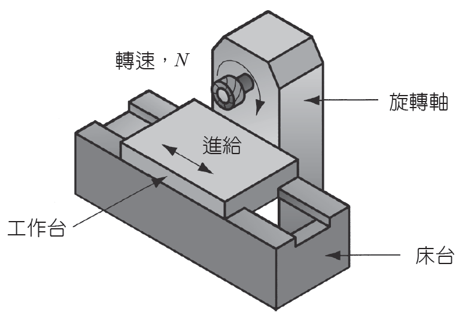

# 16.4 鋑削

來源：第 16 章《機械加工作業和機具》簡報。

本檔依原簡報投影片順序整理，保留逐頁文字內容，並在相同投影片下附上對應圖片或圖表影像。

## 投影片 35

### 文字內容

- 16.4 銑削
- 是一種將旋轉的多切刃圓筒形刀具進給入工件的機械加工作業。
- 刀具轉軸和進給方向互相垂直。
- 銑削所使用的刀具稱為銑刀 (milling cutter)。
- 其切刃則稱為齒。
- 機具稱為銑床 (milling machine)。
- 是斷續性的切削 (interrupted cutting) 作業。
- 所創建的幾何形狀是一個平面。
- 其他工件的幾何形狀也可以。

## 投影片 36

### 文字內容

- 銑削的兩種形式
- 16.4 銑削

### 圖片 / 圖表

## 投影片 37

### 文字內容

- 周邊銑削與面銑削
- 周邊銑削 (Peripheral milling)
- 其刀具的軸線和加工表面平行。
- 切削時是由刀具外周邊的切刃來執行。
- 面銑削 (Face milling)
- 刀具的轉軸和被銑削的表面呈垂直。
- 加工時是由刀具邊端和周邊的切刃進行切削。
- 16.4 銑削

## 投影片 38

### 文字內容

- 周邊銑削的類型
- 16.4 銑削

### 圖片 / 圖表

## 投影片 39

### 文字內容

- 周邊銑削依刀具旋轉的方向分類
- 16.4 銑削

### 圖片 / 圖表

## 投影片 40

### 文字內容

- 面銑削的類型
- 16.4 銑削

### 圖片 / 圖表

## 投影片 41

### 文字內容

- 臥式平面銑削的情況
- 16.4 銑削

### 圖片 / 圖表

## 投影片 42

### 文字內容

- 面銑削時考慮的可能情形
- 16.4 銑削

### 圖片 / 圖表

## 投影片 43

### 文字內容

- 銑床
- 銑床必須為刀具提供旋轉主軸及工件提供用於緊固定位和進給的工作台。
- 先銑床可以歸類為
- 臥式銑床 (horizontal milling machine)：
- 具有一個水平轉軸，適合在立方體形的工件上執行周邊銑削。
- 例如，臥式平面銑削、開槽、側銑削和跨銑削。
- 立式銑床 (vertical milling machine)：
- 有一垂直轉軸，適合在相對平坦的工件上執行面銑、端銑、表面輪廓和雕模。
- 16.4 銑削

## 投影片 44

### 文字內容

- 膝柱型銑床
- 16.4 銑削

### 圖片 / 圖表

## 投影片 45

### 文字內容

- 膝柱式銑床的特殊形式
- 16.4 銑削

### 圖片 / 圖表

## 投影片 46

### 文字內容

- 臥式單軸床型銑床
- 16.4 銑削

### 圖片 / 圖表

