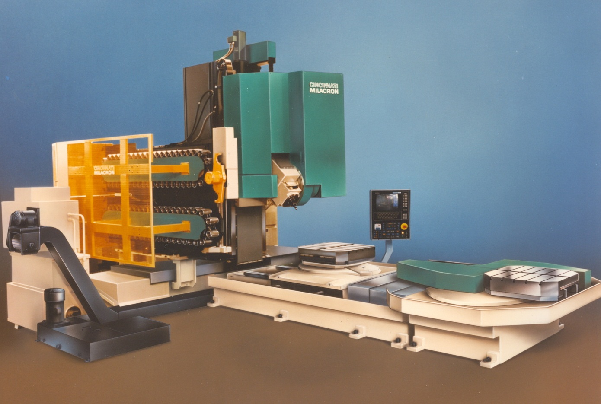
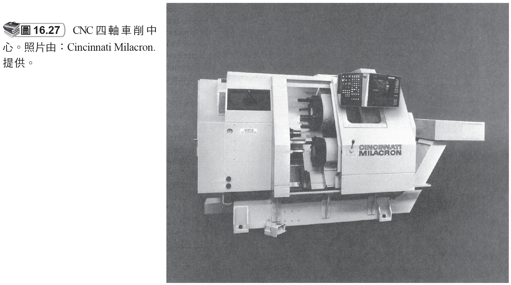
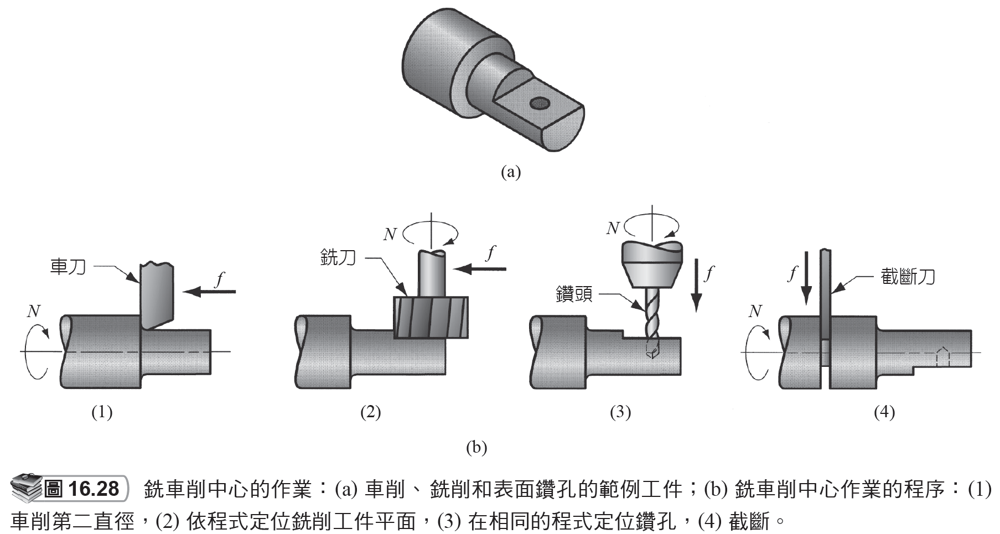

# 16.5 綜合加工機和車削中心

來源：第 16 章《機械加工作業和機具》簡報。

本檔依原簡報投影片順序整理，保留逐頁文字內容，並在相同投影片下附上對應圖片或圖表影像。

## 投影片 47

### 文字內容

- 16.5 綜合加工機和車削中心綜合加工機
- 是一種由電腦數值控制，具執行多項加工作業的高度自動化機器。其僅需要一次設定並且不需要太多的人為關注。
- 綜合加工機典型的作業是使用旋轉刀具的銑削和鑽孔。
- 生產力高的原因：
- 一次設定多個作業 (Multiple operations in one setup)
- 自動換刀 (Automatic tool changing)
- 梭動托台 (Pallet shuttles)
- 工件的自動定位 (Automatic workpart positioning)

### 研究所層級專有名詞解釋

- **電腦數值控制**：CNC 將刀具路徑、主軸、進給與輔助功能數位化控制；研究重點包含插補、伺服誤差、加減速與後處理。
- **綜合加工機**：Machining center 是具 CNC 控制、自動換刀與多工序整合能力的機具，核心價值是降低裝夾次數與非切削時間。
- **自動換刀**：Automatic tool changing 透過刀庫與換刀機構縮短非切削時間，也讓一台機具能完成多種刀具需求。
- **梭動托台**：Pallet shuttle 讓一個托台加工時另一個托台上下料，可提升設備利用率並降低停機時間。
- **自動定位**：Automatic positioning 以旋轉工作台、分度盤或多軸控制改變工件姿態，減少重新夾持。
- **車削中心**：Turning center 是 CNC 車床的自動化型態，可整合刀塔、夾頭、尾座、動力刀具與副主軸。
- **車削**：Turning 以工件旋轉為主運動、單點刀具進給為輔運動，適合產生軸對稱外形並可延伸至端面、槽、錐面與螺紋。
- **鑽孔**：Drilling 以旋轉鑽頭建立圓孔，孔品質受鑽尖幾何、排屑、冷卻、走偏與工件材料影響。
- **銑削**：Milling 以旋轉多刃刀具間歇切削工件，可加工平面、槽、輪廓與曲面；其動態負載比車削更週期化。
- **設定**：Setup 指一次裝夾與基準建立；設定次數越多，累積定位誤差、工時與檢驗負擔通常越高。
- **鑽**：Drill 是孔加工刀具，兼具切削刃、容屑槽與導向邊；深孔加工時排屑與冷卻比單純切削更關鍵。

## 投影片 48

### 文字內容

- CNC 綜合加工機

### 圖片 / 圖表

### 研究所層級專有名詞解釋

- **綜合加工機**：Machining center 是具 CNC 控制、自動換刀與多工序整合能力的機具，核心價值是降低裝夾次數與非切削時間。
- **CNC**：Computer numerical control，以程式控制機台運動與加工循環；它讓複雜幾何與重複生產可系統化。

### 圖片 / 圖表研究所說明

- 圖 1：CNC 綜合加工機圖片應觀察刀庫、主軸、工作台與防護罩。其核心價值是一次裝夾完成多工序，降低人工換刀與重複定位誤差。
- 圖 2：若圖中呈現刀庫、換刀機構或機台內部配置，重點是理解刀具流、工件流與切削區隔離。研究所層級可進一步討論刀庫容量、換刀時間、主軸熱變形與機台稼動率之間的取捨。

## 投影片 49

### 文字內容

- CNC 銑車削中心

### 圖片 / 圖表

### 研究所層級專有名詞解釋

- **銑車削中心**：Mill-turn center 結合車削主軸與旋轉刀具，可一次裝夾完成軸類件上的外圓、孔、平面與槽。
- **車削中心**：Turning center 是 CNC 車床的自動化型態，可整合刀塔、夾頭、尾座、動力刀具與副主軸。
- **CNC**：Computer numerical control，以程式控制機台運動與加工循環；它讓複雜幾何與重複生產可系統化。
- **車削**：Turning 以工件旋轉為主運動、單點刀具進給為輔運動，適合產生軸對稱外形並可延伸至端面、槽、錐面與螺紋。

### 圖片 / 圖表研究所說明

- CNC 銑車削中心圖展示車削主軸與旋轉刀具共存。研究所層級應關注多軸同步、刀具干涉檢查、座標轉換與後處理程式正確性。

## 投影片 50

### 文字內容

- 銑車削中心
- 這種機具有車削中心的一般結構。
- 它可以把圓柱狀工件定位在特定的角度並旋轉刀具 (例如，銑刀) 加工工件的外表面。
- 一個普通的車削中心無法停止工件在特定的角度位置，而且也不具有可旋轉的刀具軸。

### 研究所層級專有名詞解釋

- **銑車削中心**：Mill-turn center 結合車削主軸與旋轉刀具，可一次裝夾完成軸類件上的外圓、孔、平面與槽。
- **車削中心**：Turning center 是 CNC 車床的自動化型態，可整合刀塔、夾頭、尾座、動力刀具與副主軸。
- **車削**：Turning 以工件旋轉為主運動、單點刀具進給為輔運動，適合產生軸對稱外形並可延伸至端面、槽、錐面與螺紋。
- **銑刀**：Milling cutter 的齒數、螺旋角、直徑與刀具材料會決定切削負載分配、排屑與表面紋理。

## 投影片 51

### 文字內容

- 銑車削中心的作業

### 圖片 / 圖表

### 研究所層級專有名詞解釋

- **銑車削中心**：Mill-turn center 結合車削主軸與旋轉刀具，可一次裝夾完成軸類件上的外圓、孔、平面與槽。
- **車削中心**：Turning center 是 CNC 車床的自動化型態，可整合刀塔、夾頭、尾座、動力刀具與副主軸。
- **車削**：Turning 以工件旋轉為主運動、單點刀具進給為輔運動，適合產生軸對稱外形並可延伸至端面、槽、錐面與螺紋。

### 圖片 / 圖表研究所說明

- 銑車削中心作業圖可觀察圓柱工件在固定角度下被旋轉刀具加工。這說明 C 軸定位與動力刀具可讓車床完成偏心孔、平面或槽。
