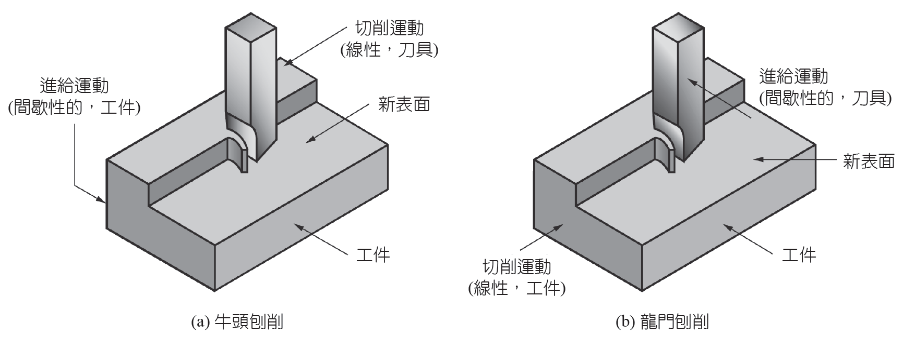
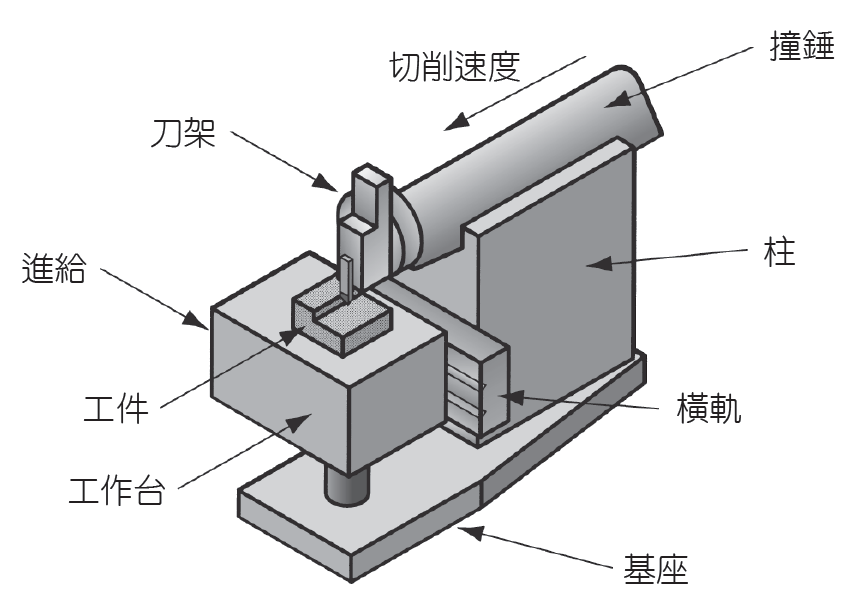
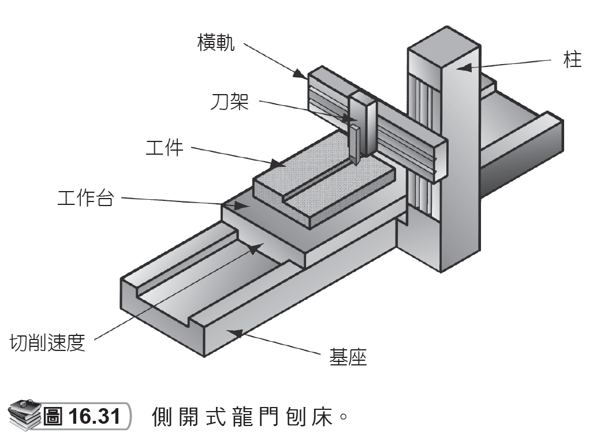
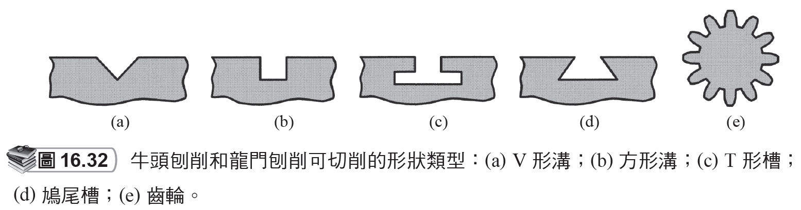
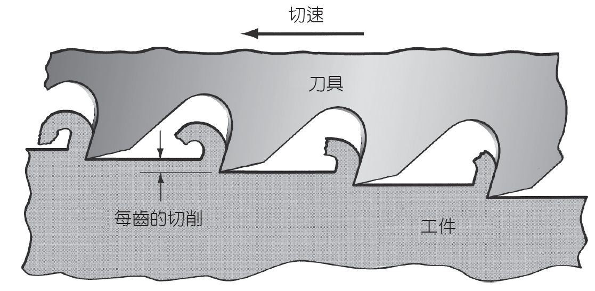
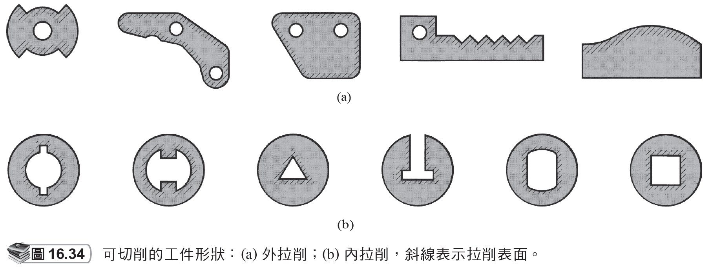
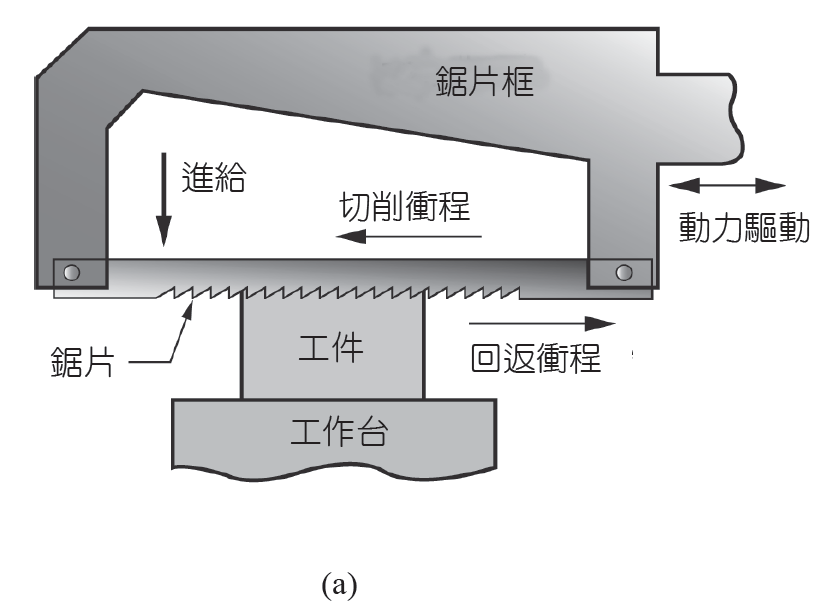
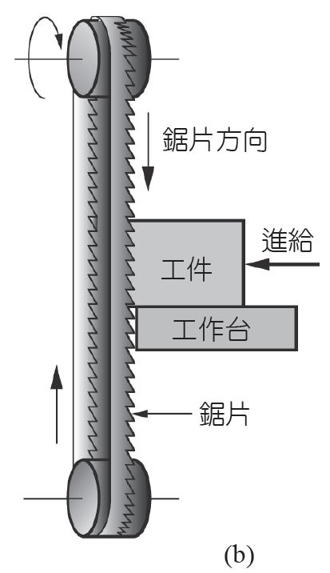
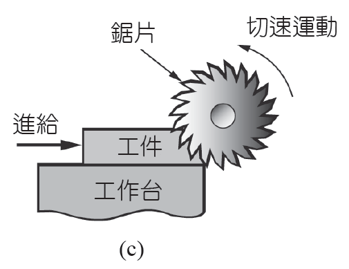

# 16.6 其他機械加工作業

來源：第 16 章《機械加工作業和機具》簡報。

本檔依原簡報投影片順序整理，保留逐頁文字內容，並在相同投影片下附上對應圖片或圖表影像。

## 投影片 52

### 文字內容

- 16.6 其他機械加工作業牛頭刨削和龍門刨削 -1

### 圖片 / 圖表

### 研究所層級專有名詞解釋

- **機械加工**：以刀具相對於工件的受控運動移除材料，核心分析量包含切削速度、進給、切深、刀具幾何、切削力、熱、振動與表面完整性。
- **牛頭刨削**：Shaping 通常由單點刀具往復運動切削平面，適合低速、低產量或特殊形狀加工。
- **龍門刨削**：Planing 通常由大型工件往復通過刀具，適合大型平面，但生產效率低於現代銑削。

### 圖片 / 圖表研究所說明

- 牛頭刨削與龍門刨削圖應注意往復運動造成的非切削回程。其效率低於連續旋轉切削，但對理解單點刀具生成平面很有幫助。

## 投影片 53

### 文字內容

- 牛頭刨削和龍門刨削 -2
- 皆可創建平直的表面
- 斷續性的切割
- 刀具在進入工件時會有衝擊負載。
- 典型工具：單點高速鋼的切削刀具。
- 這些機器的刀具由於需走走停停，故只能用低速運動。

### 研究所層級專有名詞解釋

- **切削刀具**：承受高接觸壓力與局部高溫的楔形工具；設計時需平衡鋒利度、強度、導熱、耐磨耗與抗崩裂能力。
- **牛頭刨削**：Shaping 通常由單點刀具往復運動切削平面，適合低速、低產量或特殊形狀加工。
- **龍門刨削**：Planing 通常由大型工件往復通過刀具，適合大型平面，但生產效率低於現代銑削。
- **衝擊負載**：刀具進入工件瞬間產生的載荷突變，會提高崩刃、振動與機台結構疲勞風險。
- **高速鋼**：High-speed steel 具較佳韌性與抗衝擊性，適合低速或斷續切削，但高溫硬度低於硬質合金。
- **創建**：Generating 指由刀具軌跡掃掠出幾何形狀，研究所層級會把它視為刀具包絡面、相對運動學與幾何誤差的問題。

## 投影片 54

### 文字內容

- 牛頭刨床 (shaper)

### 圖片 / 圖表

### 圖片 / 圖表研究所說明

- 牛頭刨床圖顯示刀具往復、工件橫向進給的基本結構。研究重點是切削行程與回程的時間分配，以及衝擊負載對刀具壽命的影響。

## 投影片 55

### 文字內容

- 龍門刨床 (planer)

### 圖片 / 圖表

### 圖片 / 圖表研究所說明

- 龍門刨床圖顯示大型工件在工作台上往復通過刀具。此機具適合大型平面，但現代常被大型銑床或龍門加工中心取代。

## 投影片 56

### 文字內容

- 牛頭和龍門刨削可切削的形狀類型

### 圖片 / 圖表

### 研究所層級專有名詞解釋

- **龍門刨削**：Planing 通常由大型工件往復通過刀具，適合大型平面，但生產效率低於現代銑削。

### 圖片 / 圖表研究所說明

- 此圖列出刨削可產生的槽、平面與角面。圖像重點是單點刀具藉由直線往復與橫向進給逐步生成表面。

## 投影片 57

### 文字內容

- 拉削 (Broaching) -1

### 圖片 / 圖表

### 研究所層級專有名詞解釋

- **拉削**：Broaching 使用多齒拉刀一次通過逐步切除材料，適合高精度輪廓與大量生產。

### 圖片 / 圖表研究所說明

- 拉削圖應觀察拉刀齒高逐步增加。每一齒只切除少量材料，整支拉刀等同把粗加工到精加工整合在一次行程中。

## 投影片 58

### 文字內容

- 拉削 -2
- 優點：
- 有良好表面
- 公差小
- 工件形狀的多樣性
- 切削刀具稱為拉刀 (broach)。
- 由於拉刀的設計複雜且經常需客製化其幾何形狀，因此其價格昂貴。

### 研究所層級專有名詞解釋

- **切削刀具**：承受高接觸壓力與局部高溫的楔形工具；設計時需平衡鋒利度、強度、導熱、耐磨耗與抗崩裂能力。
- **拉削**：Broaching 使用多齒拉刀一次通過逐步切除材料，適合高精度輪廓與大量生產。
- **拉刀**：Broach 由粗切齒、半精切齒與精切齒組成，刀具本身包含完整製程序列，因此成本高但節拍快。
- **公差**：Tolerance 是允許尺寸或幾何偏差範圍；它應由功能需求決定，過度收緊會顯著提高製造與檢驗成本。

## 投影片 59

### 文字內容

- 拉削可切割的工件形狀

### 圖片 / 圖表

### 研究所層級專有名詞解釋

- **拉削**：Broaching 使用多齒拉刀一次通過逐步切除材料，適合高精度輪廓與大量生產。

### 圖片 / 圖表研究所說明

- 拉削形狀圖顯示花鍵、鍵槽、非圓孔等輪廓。這些形狀若用一般刀具加工效率低，拉削則以昂貴專用刀具換取高節拍與高重複性。

## 投影片 60

### 文字內容

- 鋸削 (Sawing)
- 是由一系列狹間隔的鋸齒所組成的刀具在工件中切出一狹窄縫隙的製程。
- 工具稱為鋸片(saw blade)。
- 功用：
- 分開工件成兩塊
- 將不需要的部分切除
- 從平坦的工件切出輪廓

### 研究所層級專有名詞解釋

- **鋸削**：Sawing 以多齒刀具切出窄縫，主要用於分離材料或切割外形；重點是鋸路寬度、齒距與排屑。
- **鋸片**：Saw blade 的齒形、齒距、張力與材料決定切割效率、切縫品質與刀具壽命。
- **齒**：Tooth 是銑刀上的單一切削刃；每齒進給量是分析切屑厚度與刀具負載的基本量。

## 投影片 61

### 文字內容

- 動力弓鋸床 (power hacksaw)
- 鋸片對工件做線性往復運動。

### 圖片 / 圖表

### 研究所層級專有名詞解釋

- **動力弓鋸床**：Power hacksaw 以往復直線運動切削，結構簡單但效率較低，適合小批量切斷。
- **鋸片**：Saw blade 的齒形、齒距、張力與材料決定切割效率、切縫品質與刀具壽命。

### 圖片 / 圖表研究所說明

- 動力弓鋸床圖顯示往復切削與間歇進給。需注意回程通常不切削，因此效率較帶鋸或圓鋸低。

## 投影片 62

### 文字內容

- 帶鋸機 (bandsaw)
- 使用單邊有鋸齒的帶鋸片(bandsaw blade)，以無盡彈性循環的形式做線性的連續運動。

### 圖片 / 圖表

### 研究所層級專有名詞解釋

- **帶鋸機**：Bandsaw 以連續帶鋸片切削，切削較平穩且材料利用率佳，是材料切斷常見設備。
- **鋸片**：Saw blade 的齒形、齒距、張力與材料決定切割效率、切縫品質與刀具壽命。
- **齒**：Tooth 是銑刀上的單一切削刃；每齒進給量是分析切屑厚度與刀具負載的基本量。

### 圖片 / 圖表研究所說明

- 帶鋸機圖重點是連續帶狀刀具、導輪與工件支撐。帶鋸切縫較窄，材料利用率好，但刀帶張力與導引精度會影響切面直線度。

## 投影片 63

### 文字內容

- 圓鋸 (circular sawing)
- 使用旋轉的鋸片提供刀具以連續運動通過工件。

### 圖片 / 圖表

### 研究所層級專有名詞解釋

- **鋸片**：Saw blade 的齒形、齒距、張力與材料決定切割效率、切縫品質與刀具壽命。
- **圓鋸**：Circular sawing 以旋轉鋸片高速切削，適合快速切斷棒材、管材或板材。

### 圖片 / 圖表研究所說明

- 圓鋸圖顯示旋轉鋸片連續切削。其優勢是切斷速度高，但熱、毛邊與鋸片剛性需透過齒形、冷卻與進給控制管理。
