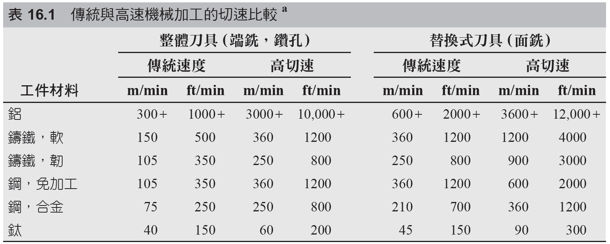
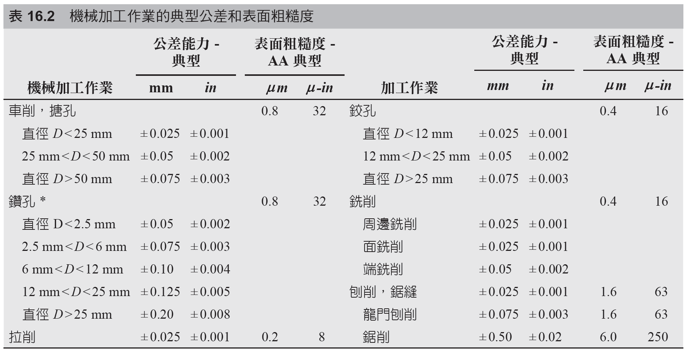

# 16.7 高速機械加工

來源：第 16 章《機械加工作業和機具》簡報。

本檔依原簡報投影片順序整理，保留逐頁文字內容，並在相同投影片下附上對應圖片或圖表影像。

## 投影片 64

### 文字內容

- 16.7 高速機械加工 -1
- 明顯高於傳統加工作業中的切削速度。
- 整個金屬機械加工歷史的一個持續趨勢是使用的切削速度越來越高。
- 近年來，此一領域的興趣被重新喚起，主要是因其具有加快生產速度、縮短前置時間、降低成本及提高零件品質的潛力。

### 研究所層級專有名詞解釋

- **高速機械加工**：HSM 不只是高轉速，而是高主軸速度、高進給、低切深、穩定刀具路徑與高動態伺服的系統整合。
- **機械加工**：以刀具相對於工件的受控運動移除材料，核心分析量包含切削速度、進給、切深、刀具幾何、切削力、熱、振動與表面完整性。
- **切削速度**：刀刃相對工件表面的線速度，影響切削溫度、刀具磨耗型態、切屑形成與材料去除效率。

## 投影片 65

### 文字內容

- 高速機械加工 -2

### 圖片 / 圖表

### 研究所層級專有名詞解釋

- **高速機械加工**：HSM 不只是高轉速，而是高主軸速度、高進給、低切深、穩定刀具路徑與高動態伺服的系統整合。
- **機械加工**：以刀具相對於工件的受控運動移除材料，核心分析量包含切削速度、進給、切深、刀具幾何、切削力、熱、振動與表面完整性。

### 圖片 / 圖表研究所說明

- 高速機械加工圖通常呈現高轉速主軸或高速銑削狀態。閱讀時要連結到系統需求：動平衡、預讀控制、排屑與熱控制缺一不可。

## 投影片 66

### 文字內容

- HSM 的其他定義：DN 比
- DN 比 (DN ratio) = 軸承內孔直徑 (mm) 乘以主軸最高轉速 (rev/min)。
- 對於高速加工，典型的 DN 比是介於 500,000 到 1,000,000 之間。
- 此一定義使較大的軸承直徑可落在 HSM 的範圍內，即使它們在比較小直徑的軸承作業還低的轉速。

### 研究所層級專有名詞解釋

- **DN 比**：軸承內徑乘以主軸最高轉速，用於描述高速主軸軸承能力；值越高代表軸承在離心力與發熱下的設計要求越嚴格。

## 投影片 67

### 文字內容

- HSM 的其他定義：hp/rpm 比
- hp/rpm 比 (hp/rpm ratio) = 馬力和最高主軸轉速的比例。
- 傳統機具通常比配備高速加工機具有較高的 hp/rpm 比。
- 傳統機械加工和 HSM 之間的分界線大約是 0.005 hp/rpm。
- 因此，高速加工包括 15 馬力使主軸轉速達 30,000 rpm (0.0005 hp/rpm)。

### 研究所層級專有名詞解釋

- **hp/rpm 比**：主軸馬力與最高轉速的比值，反映高速機低扭矩高轉速的特性；不能單獨代表實際切削能力。
- **機械加工**：以刀具相對於工件的受控運動移除材料，核心分析量包含切削速度、進給、切深、刀具幾何、切削力、熱、振動與表面完整性。

## 投影片 68

### 文字內容

- 高速加工的要求
- 使用為高轉速操作設計的特殊軸承高速主軸。
- 高進給量，通常約 50 m/min (2000 in/min)。
- CNC 的運動控制具「預讀」功能，以避免下衝或超調所需的刀具路徑。
- 平衡的刀具，刀柄和主軸。
- 冷卻液輸送系統提供遠大於傳統加工的壓力。
- 切屑控制和除屑系統能應付 HSM 更大的金屬切除率。

### 研究所層級專有名詞解釋

- **切屑控制**：控制切屑形狀、長度與排出方向，避免纏屑、刮傷表面、阻塞刀路或造成自動化停機。
- **CNC**：Computer numerical control，以程式控制機台運動與加工循環；它讓複雜幾何與重複生產可系統化。
- **冷卻液**：Coolant 不只降溫，也有潤滑、排屑與抑制積屑瘤功能；高壓冷卻在高速與深孔加工更重要。
- **進給**：刀具每轉或每齒相對工件前進量，是材料移除率、刀痕高度、切削力與表面粗糙度的主控參數之一。
- **預讀**：Look-ahead 控制讓 CNC 預先分析後續刀路，以平滑加減速並避免轉角過衝或速度突降。
- **刀柄**：Tool holder 連接刀具與主軸，其動平衡、夾持剛性與跳動量對高速加工尤其關鍵。

## 投影片 69

### 文字內容

- 機械加工的典型公差和表面粗糙度

### 圖片 / 圖表

### 研究所層級專有名詞解釋

- **表面粗糙度**：Surface roughness 是表面微觀高度變化的量化指標，常用 Ra 或 Rz 表示。
- **機械加工**：以刀具相對於工件的受控運動移除材料，核心分析量包含切削速度、進給、切深、刀具幾何、切削力、熱、振動與表面完整性。
- **公差**：Tolerance 是允許尺寸或幾何偏差範圍；它應由功能需求決定，過度收緊會顯著提高製造與檢驗成本。

### 圖片 / 圖表研究所說明

- 典型公差與表面粗糙度圖應用來比較各加工法能力範圍，而不是視為固定值。實際能力會受材料、刀具、機台狀態與製程控制程度影響。
