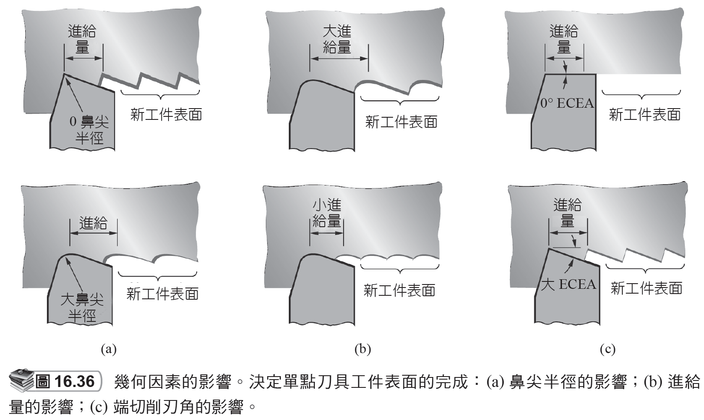
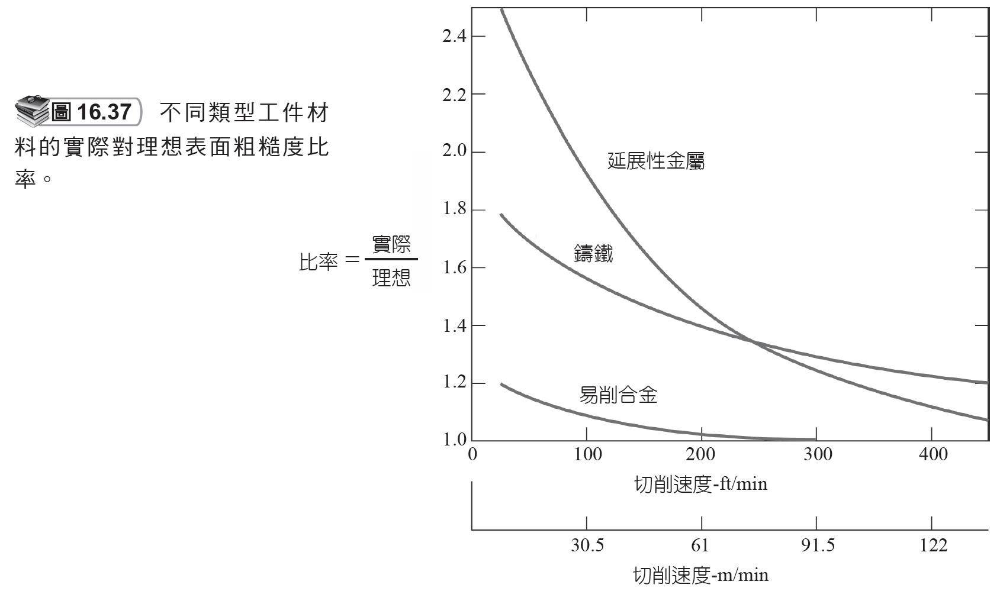

# 16.8 公差和表面光潔度

來源：第 16 章《機械加工作業和機具》簡報。

本檔依原簡報投影片順序整理，保留逐頁文字內容，並在相同投影片下附上對應圖片或圖表影像。

## 投影片 70

### 文字內容

- 16.8 公差和表面光潔度
- 公差
- 機械加工製程較其他大多數成形製程更準確。
- 更緊密的公差通常意味著更高的成本。
- 加工表面的粗糙度依賴許多因素，歸納如下：
- 幾何因素
- 工件材料因素
- 振動和機具因素。

### 研究所層級專有名詞解釋

- **表面光潔度**：Surface finish 描述加工表面的微觀起伏與紋理，會影響摩擦、疲勞、密封、磨耗與外觀。
- **機械加工**：以刀具相對於工件的受控運動移除材料，核心分析量包含切削速度、進給、切深、刀具幾何、切削力、熱、振動與表面完整性。
- **幾何因素**：由刀具幾何與運動學直接造成的理想表面輪廓，例如刀鼻半徑與進給形成的殘留高度。
- **成形**：Forming 指工件輪廓主要由刀具輪廓直接複製；其限制常來自刀具製造精度、磨耗後輪廓漂移與切削負載集中。
- **公差**：Tolerance 是允許尺寸或幾何偏差範圍；它應由功能需求決定，過度收緊會顯著提高製造與檢驗成本。
- **振動**：切削系統的動態不穩定會放大表面波紋、縮短刀具壽命並造成尺寸變異；顫振是最典型問題。

## 投影片 71

### 文字內容

- 幾何因素
- 機械加工參數決定加工工件的表面幾何：
- (1) 機械加工作業的類型
- (2) 刀具的幾何形狀，最重要的是刀鼻半徑
- (3) 進給量
- 由這些因素所導致的表面幾何形狀，稱為「理想」或「理論」的表面粗糙度。

### 研究所層級專有名詞解釋

- **表面粗糙度**：Surface roughness 是表面微觀高度變化的量化指標，常用 Ra 或 Rz 表示。
- **機械加工**：以刀具相對於工件的受控運動移除材料，核心分析量包含切削速度、進給、切深、刀具幾何、切削力、熱、振動與表面完整性。
- **幾何因素**：由刀具幾何與運動學直接造成的理想表面輪廓，例如刀鼻半徑與進給形成的殘留高度。
- **刀鼻半徑**：Tool nose radius 越大通常可降低理想粗糙度並分散負載，但過大可能增加徑向力與顫振。
- **進給**：刀具每轉或每齒相對工件前進量，是材料移除率、刀痕高度、切削力與表面粗糙度的主控參數之一。

## 投影片 72

### 文字內容

- 幾何因素的影響

### 圖片 / 圖表

### 研究所層級專有名詞解釋

- **幾何因素**：由刀具幾何與運動學直接造成的理想表面輪廓，例如刀鼻半徑與進給形成的殘留高度。

### 圖片 / 圖表研究所說明

- 幾何因素圖可視覺化刀鼻半徑與進給造成的理想表面波峰。研究重點是理想粗糙度隨進給平方增加、隨刀鼻半徑增加而降低。

## 投影片 73

### 文字內容

- 其中 Ri = 理論算術平均表面粗糙度；f = 進給；NR = 刀尖的鼻尖半徑。
- 理想表面的平均粗糙度

### 研究所層級專有名詞解釋

- **表面粗糙度**：Surface roughness 是表面微觀高度變化的量化指標，常用 Ra 或 Rz 表示。
- **進給**：刀具每轉或每齒相對工件前進量，是材料移除率、刀痕高度、切削力與表面粗糙度的主控參數之一。
- **Ri**：理論算術平均粗糙度，常作為理想幾何表面品質的估算量。
- **NR**：刀尖鼻半徑；在車削粗糙度估算中，進給平方與鼻半徑成反比關係是重要趨勢。

## 投影片 74

### 文字內容

- 工件材料因素
- 堆積刃 (built-up edge, BUE) 的影響。
- 由於切屑曲捲回工件表面造成損害。
- 當加工於延展性材料時，切屑形成過程中引起工件表面撕裂。
- 當加工於脆性材料時，不連續的切屑形成表面裂縫。
- 新表面和刀具側邊產生摩擦。

### 研究所層級專有名詞解釋

- **延展性材料**：切削時傾向形成連續切屑，若刀具或切削條件不佳，容易發生塗抹、撕裂與積屑瘤。
- **脆性材料**：切削時容易形成不連續切屑，表面品質常受微裂紋、崩落與材料非均質性影響。
- **堆積刃**：Built-up edge 是工件材料黏附在刀刃形成的暫時切削邊，會改變有效刀具幾何並造成表面撕裂。
- **BUE**：Built-up edge 的縮寫，常在低到中速切削延展性材料時出現，可透過提高速度、改善潤滑或改變刀具材質降低。

## 投影片 75

### 文字內容

- 工件材料因素的影響

### 圖片 / 圖表

### 圖片 / 圖表研究所說明

- 工件材料因素圖顯示實際表面可能偏離理想幾何。積屑瘤、撕裂、裂紋與摩擦會讓粗糙度高於幾何模型預測。

## 投影片 76

### 文字內容

- 例16.1 表面粗糙度 -1
- 在 C1008 鋼(一個相對有延展性的材料) 上進行車削作業，使用刀具的鼻尖半徑 = 1.2 mm。切削速度 = 100 m/min，進給量 = 0.25 mm/rev。試計算估計的表面粗糙度。
- 解：
- 理想的表面粗糙度，可以由公式 (16.21) 算出：

### 研究所層級專有名詞解釋

- **C1008 鋼**：低碳鋼，延展性較高，車削時容易受積屑瘤與材料塗抹影響，使實際粗糙度高於理想值。
- **表面粗糙度**：Surface roughness 是表面微觀高度變化的量化指標，常用 Ra 或 Rz 表示。
- **切削速度**：刀刃相對工件表面的線速度，影響切削溫度、刀具磨耗型態、切屑形成與材料去除效率。
- **進給**：刀具每轉或每齒相對工件前進量，是材料移除率、刀痕高度、切削力與表面粗糙度的主控參數之一。
- **車削**：Turning 以工件旋轉為主運動、單點刀具進給為輔運動，適合產生軸對稱外形並可延伸至端面、槽、錐面與螺紋。

## 投影片 77

### 文字內容

- 例16.1 表面粗糙度 -2
- 從圖 16.37 中可查出韌性金屬在切削速度 100 m/min 的理想對實際粗糙度的比率大約是 1.25。因此，實際表面粗糙度估計約

### 研究所層級專有名詞解釋

- **表面粗糙度**：Surface roughness 是表面微觀高度變化的量化指標，常用 Ra 或 Rz 表示。
- **切削速度**：刀刃相對工件表面的線速度，影響切削溫度、刀具磨耗型態、切屑形成與材料去除效率。

## 投影片 78

### 文字內容

- 振動與機具因素
- 這些因素和機具、夾治具，和作業的設置有關：
- 機具或刀具的振動
- 變形的夾具經常引起振動
- 進給機制的反作力
- 如果這些機具因素可以被降低或消除，則加工表面粗糙度將主要由上述的幾何和工件材料因素所決定。

### 研究所層級專有名詞解釋

- **表面粗糙度**：Surface roughness 是表面微觀高度變化的量化指標，常用 Ra 或 Rz 表示。
- **進給**：刀具每轉或每齒相對工件前進量，是材料移除率、刀痕高度、切削力與表面粗糙度的主控參數之一。
- **夾具**：Fixture 用來固定工件並建立定位基準；研究所層級需分析定位自由度、夾緊力路徑與變形。
- **振動**：切削系統的動態不穩定會放大表面波紋、縮短刀具壽命並造成尺寸變異；顫振是最典型問題。

## 投影片 79

### 文字內容

- 如何防止振動
- 在設定時加入剛性或阻尼。
- 控制速度，不要讓週期性的力，其頻率接近機具系統的固有振動頻率。
- 減少進給和切深以減少切削力量。
- 改變刀具設計，以減少切削力量。

### 研究所層級專有名詞解釋

- **固有振動頻率**：系統自由振動頻率；當切削力週期接近此頻率時容易共振或顫振。
- **進給**：刀具每轉或每齒相對工件前進量，是材料移除率、刀痕高度、切削力與表面粗糙度的主控參數之一。
- **振動**：切削系統的動態不穩定會放大表面波紋、縮短刀具壽命並造成尺寸變異；顫振是最典型問題。
- **阻尼**：Damping 可耗散振動能量，提高切削穩定性；可來自結構、材料、夾具或特殊阻尼刀桿。
- **設定**：Setup 指一次裝夾與基準建立；設定次數越多，累積定位誤差、工時與檢驗負擔通常越高。
