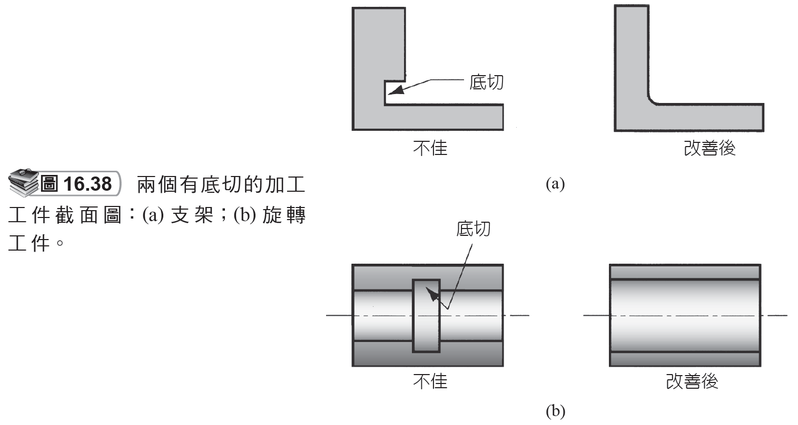
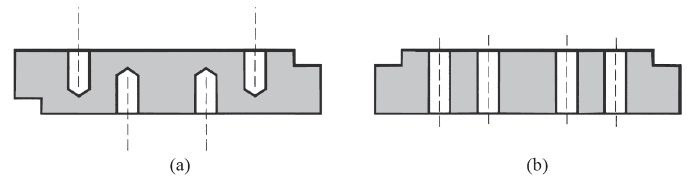

# 16.9 機械加工的產品設計考量

來源：第 16 章《機械加工作業和機具》簡報。

本檔依原簡報投影片順序整理，保留逐頁文字內容，並在相同投影片下附上對應圖片或圖表影像。

## 投影片 80

### 文字內容

- 16.9 機械加工的產品設計考量 -1
- 工件的設計，以不需要機械加工為原則。
- 由使用淨成形的製程而獲得，如精密鑄造、閉模鍛造或 (塑料) 成形。
- 若一定要加工，則盡量最小化工件上加工的需求。
- 使用接近淨成形的製程，如壓模鍛造。

## 投影片 81

### 文字內容

- 機械加工的產品設計考量 -2
- 可能需要加工的原因：
- 緊密的公差
- 良好的表面
- 特殊的幾何特徵
- 螺紋
- 精密孔
- 具高圓度的圓筒截面
- 除了加工外無法製成的類似形狀

## 投影片 82

### 文字內容

- 機械加工的產品設計考量 -3
- 公差的設定應滿足功能要求，但也需考慮製程能力。
- 過分緊密的公差會增加成本，但不能增加工件的價值。
- 當公差變的更緊密 (小) 時，成本通常會因額外的製程、夾具、檢驗、分類、重工和廢料而增加。

## 投影片 83

### 文字內容

- 機械加工的產品設計考量 -4
- 表面光潔度的設定應符合功能和或審美的需求。
- 然而較好的表面通常需要額外的作業，如輪磨或研磨，而增加製程成本。

## 投影片 84

### 文字內容

- 機械加工的產品設計考量 -5
- 機械加工的特徵應避免如尖角、邊和點。
- 它們往往難以用機械加工方式完成。
- 內尖角在加工過程中需要容易斷裂的單點刀具。
- 外尖角和邊往往容易造成毛邊和處理上的危險。

## 投影片 85

### 文字內容

- 機械加工的產品設計考量 -6
- 加工件的設計應使它們的生產可以從可用的標準物料，選擇外部尺寸等於或接近標準物料尺寸，以減少加工。
- 例如，旋轉工件的外徑等於標準棒材的直徑。

## 投影片 86

### 文字內容

- 機械加工的產品設計考量 -7
- 需選擇材料具有良好的可加工性。
- 概略的指南，可加工性是材料與可允許的切割速度及生產率的相關等級。
- 因此，低可加工的工件材料，其生產成本高。

## 投影片 87

### 文字內容

- 機械加工的產品設計考量 -8
- 應當避免底切。
- 需要額外的設定，操作和 (或) 特殊的刀具。

### 圖片 / 圖表

## 投影片 88

### 文字內容

- 機械加工的產品設計考量 -9
- 加工工件的設計應該以使用最少的設定生產。
- 有相似孔特徵的兩個工件：(a) 孔必須由兩邊加工，需要兩次設定；(b) 所有孔都可由單邊加工。

### 圖片 / 圖表

## 投影片 89

### 文字內容

- 機械加工的產品設計考量 -10
- 加工工件的設計其特徵應可以標準刀具加工。
- 避免不常見的孔洞尺寸、螺紋，或需要特殊刀具的形狀。
- 如果設計的工件可讓使用的刀具數量最小化亦有助益。
